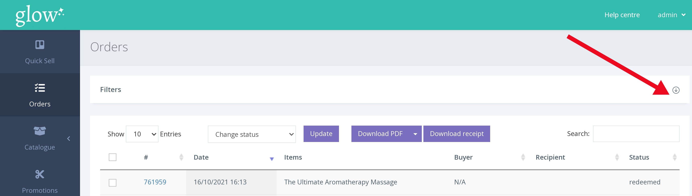
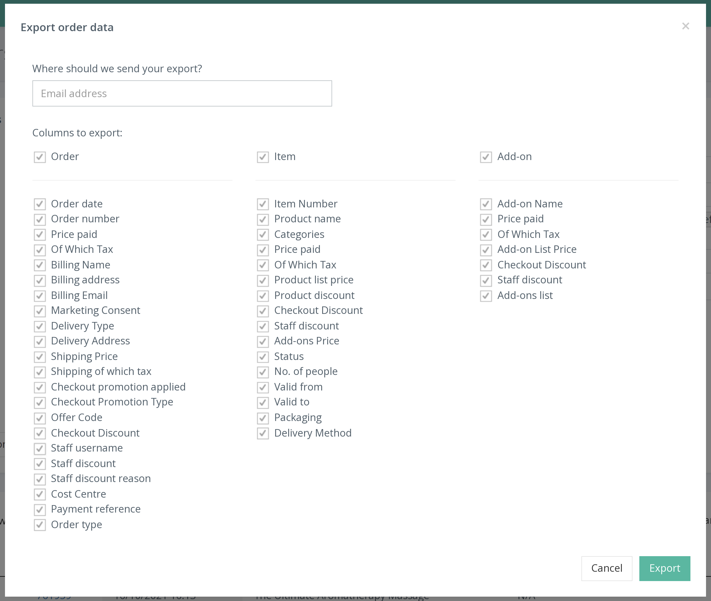

Voucherstore lets you create sales reports and have them automatically sent to an email address

From the left hand navigation select ORDERS to pull up the order page.

At the top of the page there is a filter bar. Click it to expand the window.

The filter window serves two purposes, it can be used for filtering orders/vouchers and it is also where you can create downloadable sales reports.

You have the option to filter the following parameters:
1. Date range
2. Order / Voucher status
3. Delivery Method
4. With Promo / Without Promo

After selecting the parameters click [Filter] to display the popup shown below.

Voucherstore collects a lot of data for each order, a full report will contain a large amount of data fields. If you don't need to see every field you can uncheck the appropriate boxes.

To receive the report, input your email address and click [Export]. Typically the report is sent out within 1 minute to your email address as a CSV file.
