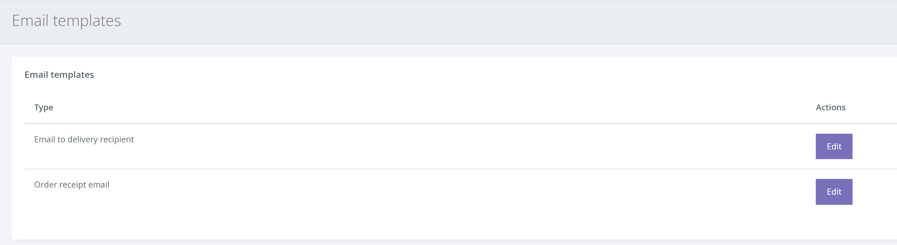

อีเมลมี 2 ประเภทที่ระบบส่งอัตโนมัติหลังการซื้อ

**อีเมลใบเสร็จการสั่งซื้อ** 

นี่คือใบเสร็จรับเงินดิจิทัล (ไม่ใช่บัตรกำนัล) ซึ่งจะออกให้แก่ผู้ซื้อเสมอเมื่อซื้อผลิตภัณฑ์จากร้านค้าออนไลน์ของคุณ

**อีเมลถึงผู้รับสินค้า** 

หากผู้ซื้อร้องขอให้จัดส่งบัตรกำนัลทางอิเล็กทรอนิกส์ อีเมลนี้จะถูกส่งไปยังผู้รับโดยอัตโนมัติ ลิงก์สำหรับดาวน์โหลด E-voucher จะรวมอยู่ในอีเมลฉบับนี้

แดชบอร์ด Voucherstore ของคุณจะมีเทมเพลตสำเร็จรูปสำหรับอีเมลทั้งสองฉบับ หากคุณต้องการปรับแต่งเทมเพลต ให้ทำตามขั้นตอนด้านล่าง

1. จากการนำทางด้านซ้ายมือ ให้เลือก SETTINGS > EMAIL SETTINGS

2. คลิก [Edit] เพื่อดูหน้าแก้ไขเทมเพลตอีเมล

3. หน้าแก้ไขเทมเพลตอีเมลให้คำอธิบายสั้น ๆ ของแต่ละส่วนรวมถึงคำแนะนำเกี่ยวกับการใช้ตัวยึดตำแหน่งแบบไดนามิก

4. แก้ไขเนื้อหาอีเมลแล้วคลิก [Save]
