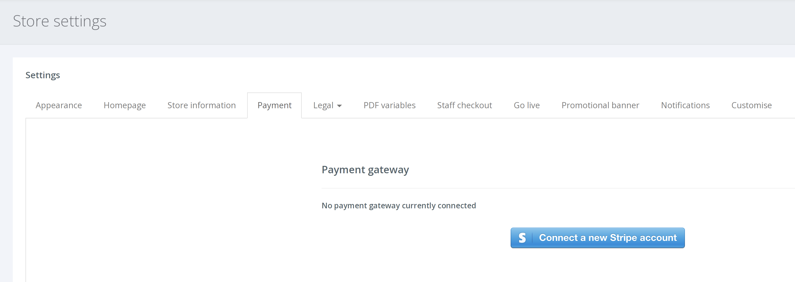

**What is a payment gateway?** 
A payment gateway is an e-commerce service that processes credit card payments for you so that you are able to take payments from cards online.

**Which payment gateways do you support?** 
Currently, we only support Stripe. Although we are planning to add more payment gateways in the future, Stripe is one of the world's most popular payment gateways.
Information on Stripe and their fees are located here.

How to connect my Stripe account?

1. Firstly, head over to Stripe to create a new account and finish the setup process.

2. Once complete, from the left hand navigation go to SETTINGS > STORE SETTINGS and select the [Payment] tab.

3. Click [Connect a new Stripe account] button. If you are already logged in to Stripe, you will be asked to confirm if you would like to link your account with Voucherstore, otherwise, you will be taken to this page to either log in or fill out some remaining information on your account.

4. After filling in the details and connecting, the process is complete and your payment gateway has been connected!
