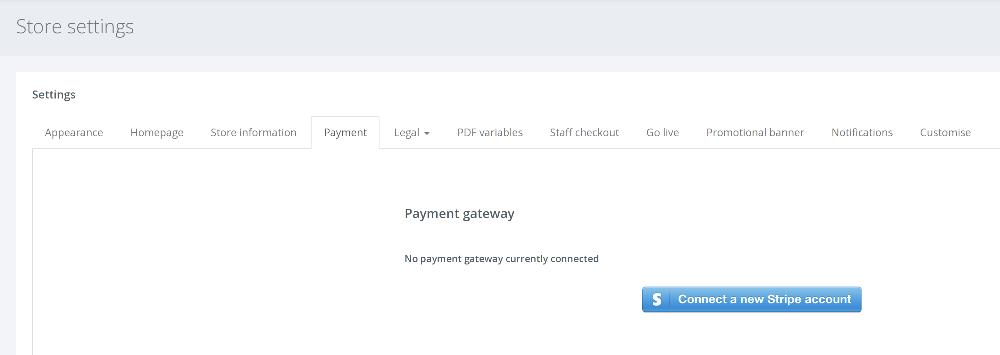

**เกตเวย์การชำระเงินคืออะไร ?** 

เกตเวย์การชำระเงินเป็นบริการอีคอมเมิร์ซที่ประมวลผลการชำระเงินด้วยบัตรเครดิตสำหรับคุณ เพื่อให้คุณสามารถรับชำระเงินจากบัตรออนไลน์ได้

**คุณสนับสนุนเกตเวย์การชำระเงินใดบ้าง** 

ขณะนี้เรารองรับเฉพาะ Stripe แม้ว่าเรากำลังวางแผนที่จะเพิ่มเกตเวย์การชำระเงินเพิ่มเติมในอนาคต Stripe เป็นหนึ่งในเกตเวย์การชำระเงินที่ได้รับความนิยมมากที่สุดในโลก

ข้อมูลเกี่ยวกับ Stripe และค่าธรรมเนียมต่าง ๆ อยู่ที่นี่

**จะเชื่อมต่อบัญชี Stripe ของฉันได้อย่างไร** 

1. ขั้นแรกตรงไปที่ Stripe เพื่อสร้างบัญชีใหม่และเสร็จสิ้นขั้นตอนการตั้งค่า

2. เมื่อเสร็จแล้ว จากการนำทางด้านซ้ายมือ ไปที่ SETTINGS > STORE SETTINGS และ เลือกแท็บ [Payment]

3. คลิกปุ่ม [Connect a new Stripe account] หากคุณลงชื่อเข้าใช้ Stripe แล้ว ระบบจะขอให้คุณยืนยันว่าคุณต้องการเชื่อมโยงบัญชีของคุณกับ Voucherstore หรือ ไม่ มิฉะนั้นคุณจะถูกนำไปที่หน้านี้เพื่อเข้าสู่ระบบหรือ กรอกข้อมูลที่เหลือในบัญชีของคุณ

4. หลังจากกรอกรายละเอียดและเชื่อมต่อกระบวนการจะเสร็จสมบูรณ์ และเกตเวย์การชำระเงินของคุณเชื่อมต่อแล้ว!
