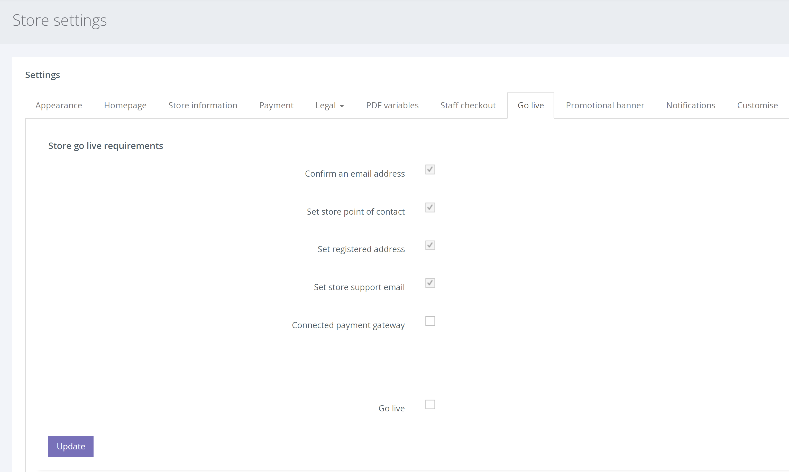

'Going Live' คือ สิ่งที่เราเรียกว่าจุดที่ บัญชี/เว็บไซต์ ของคุณได้รับการตั้งค่าอย่างสมบูรณ์และคุณพร้อมที่จะเริ่มรับคำสั่งซื้อ

มีข้อกำหนดบางประการเพื่อให้แน่ใจว่าคุณพร้อม 100% ก่อนที่จะสามารถเริ่มใช้งานจริงและเริ่มรับการชำระเงินได้

หากต้องการดูรายการข้อกำหนด จากการนำทางด้านซ้ายมือ ให้คลิก SETTINGS > STORE SETTINGS > แท็บ [Go live]

คำอธิบายเกี่ยวกับวิธีการทำให้ข้อกำหนดแต่ละข้อสมบูรณ์มีการเชื่อมโยง [ที่นี่](/help/th/going-live/connect-a-payment-gateway/) และ [ที่นี่](/help/th/going-live/setting-store-information/)

เมื่อข้อกำหนดทั้งหมดเสร็จสิ้น ให้เลือก "Go live" แล้วคลิก [Update] ร้านค้าของคุณใช้งานได้แล้ว และคุณสามารถรับการชำระเงินได้
