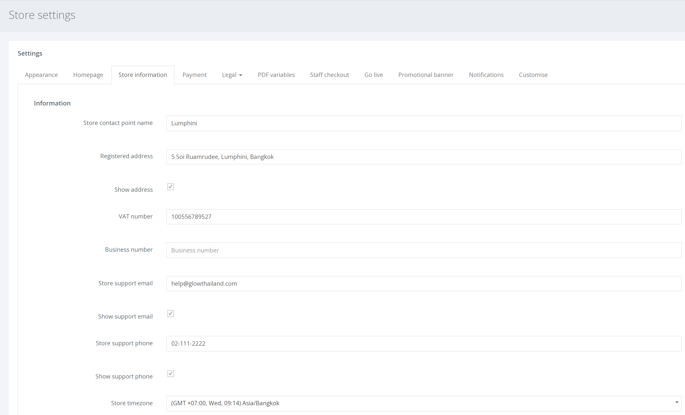

From the left hand navigation click SETTINGS > STORE SETTINGS > [Store information]

This page requires your business details prior to ‘Going Live’. Once you have completed all the necessary fields the [going live checklist](/going-live/going-live-checklist/) will automatically update.

In the example below, ‘Show’ is selected for the email, address and phone number.

Doing so will display your business details inside the footer at your online store. As shown below.

