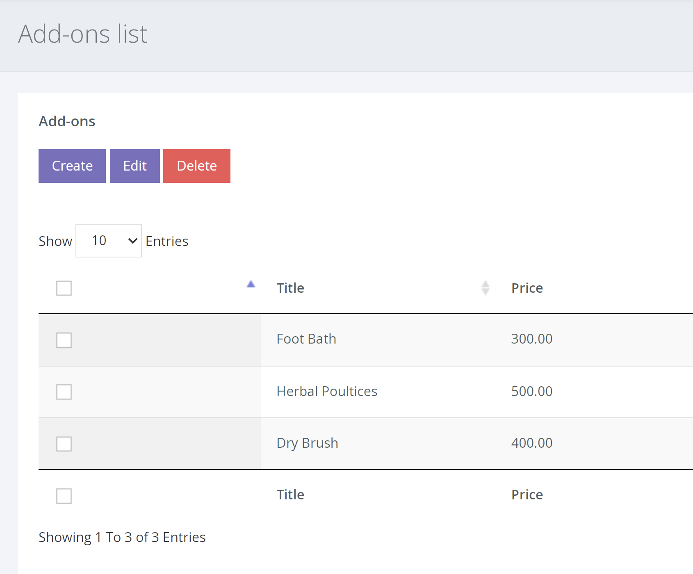
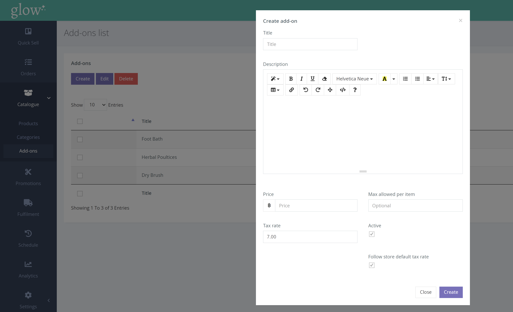

To get to the Add-Ons page, click CATALOGUE > ADD-ONS from the left hand navigation.

Once on the Add-Ons page, you will be shown a list of all current Add-Ons you have, as well as the [Create], [Edit] and [Delete] buttons.

Click on the [Create] button. After this, a pop up will appear with the fields required to create an add on.

 |  |
--- | ---
**Title** | This is the name of your ‘Add-On’ and will appear on the  product’s page.
**Max Allowed Per Item**| The maximum number of this Add-On that can be added when  purchasing a product with the Add-On available.
**Price** | The price of the Add-On. 
**Active**| Having an Add-On active will allow you to assign it to products.  If an Add-On is not ticked as active, you will not   be able to add   it to products and products that have it assigned will no longer  show that Add-On.
**Description**| This is a description of what this Add-On entails. This will be  shown on the product’s page along with the price and title.

After you save the Add-On, it will appear in the list on the Add-Ons page.

To assign an Add-On to a product, you need to either create a new product ( shown here) or to edit an existing product on the products page and to click on the [Add-Ons] tab at the top of the edit page.

Once on this tab, clicking in the white box will show you all current active Add-Ons and allow you to select them. After you have added the Add-Ons, press save and these will now be shown on that product’s page.
