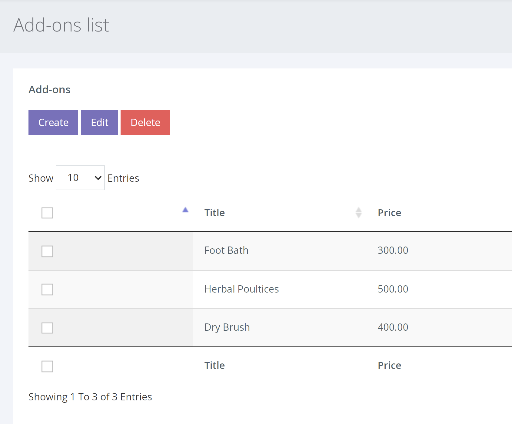

หากต้องการไปที่หน้า Add-Ons ให้คลิก CATALOG > ADD-ONS จากการนำทางด้านซ้ายมือ

เมื่ออยู่ในหน้า Add-Ons คุณจะเห็นรายการ Add-on ปัจจุบันทั้งหมดที่คุณมี รวมทั้งปุ่ม [Create], [Edit] และ [Delete]

คลิกที่ปุ่ม [Create] หลังจากนั้น ป๊อปอัปจะปรากฏขึ้นพร้อมกับฟิลด์ที่จำเป็นในการสร้าง add on

 |  |
--- | ---
**Title** | นี่คือชื่อของ 'Add-On' ของคุณและจะปรากฏบนหน้าของผลิตภัณฑ์
**Max Allowed Per Item**| จำนวนสูงสุดของAdd-On นี้ที่สามารถเพิ่มได้เมื่อซื้อผลิตภัณฑ์ที่มี Add-On ที่มีให้ 
**Price** |ราคาของ Add-On
**Active**| การมี Add-On ที่ใช้งานอยู่จะช่วยให้คุณสามารถกำหนดให้กับผลิตภัณฑ์ได้ หาก Add-On ไม่ถูกทำเครื่องหมายว่าใช้งานอยู่ คุณจะไม่สามารถเพิ่มลงในผลิตภัณฑ์และสินค้าที่ได้รับมอบหมายจะไม่แสดง Add-On นั้นอีกต่อไ
**Description**| นี่คือคำอธิบายของ Add-On นี้ ซึ่งจะแสดงบนหน้าของผลิตภัณฑ์พร้อมกับราคาและชื่อ

หลังจากที่คุณบันทึก Add-On แล้ว มันจะปรากฏในรายการบนหน้า Add-on

ในการกำหนด Add-On ให้กับผลิตภัณฑ์ คุณต้องสร้างผลิตภัณฑ์ใหม่ ( shown here) หรือ แก้ไขผลิตภัณฑ์ที่มีอยู่บนหน้าผลิตภัณฑ์ และ คลิกที่แท็บ [Add-Ons] ที่ด้านบนของหน้าแก้ไข เมื่ออยู่บนแท็บนี้

การคลิกในกล่องสีขาวจะแสดง Add-Ons ที่ใช้งานอยู่ทั้งหมดให้คุณเห็น และให้คุณเลือกได้หลังจากที่คุณได้เพิ่ม Add-Ons แล้ว ให้กดบันทึก และตอนนี้สิ่งเหล่านี้จะปรากฏบนหน้าของผลิตภัณฑ์นั้น
