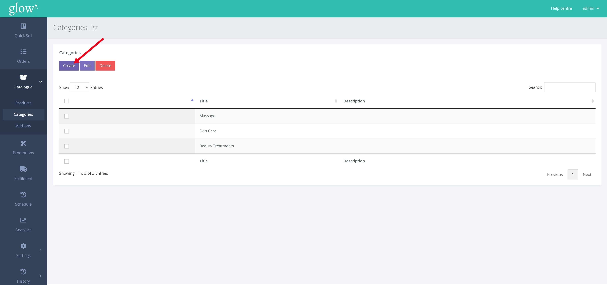
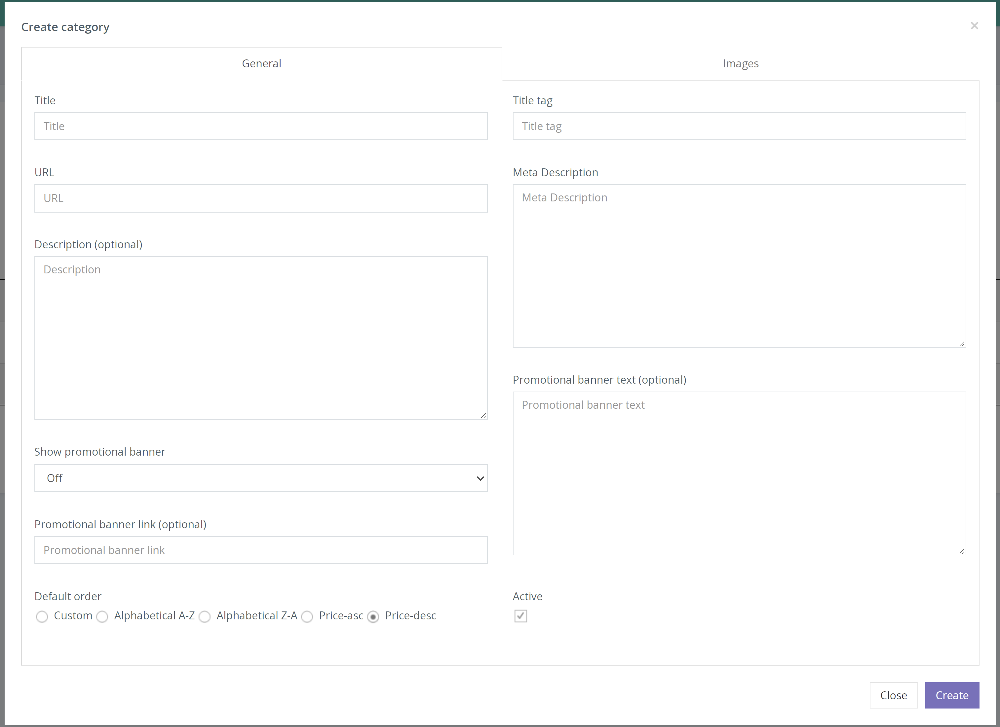

**What is a Category?** 

A category is a way to organise your products. Categories appear on the homepage and easily allow customers to filter your products through a dropdown.

**Creating a Category** 

1. From the left hand navigation click CATALOGUE > CATEGORIES, your current categories will be displayed.

2. Click the [Create] button to add a new category.

3. Under the [General] tab, fill in the details on the category popup form displayed. The table below explains the fields.

 |  |
--- | ---
**Title** | What will appear as the category name in the drop-down on the home page.
**URL**| The URL that will be given to this category. This URL will allow customers to visit the category and all of its products directly.
**Description**| A description to help differentiate between similarly named categories.
**Title Tag**| The title that will be shown when sharing the URL online on the likes of social media and messaging apps.
**Meta Description**| The description that will be shown when sharing the URL online on the likes of social media and messaging apps.
**Default Order**| How the products of the category will be shown and the order they are in.
**Active**| Sets if the category is currently active and can be seen by customers.

4. The new category is created and you can assign new or existing products to this category.
