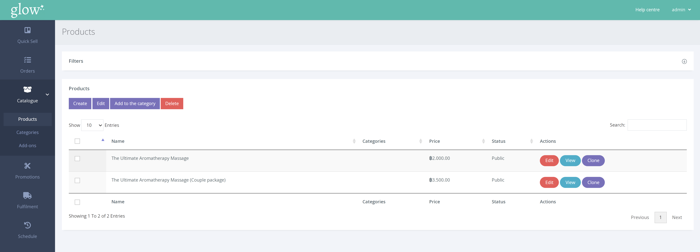
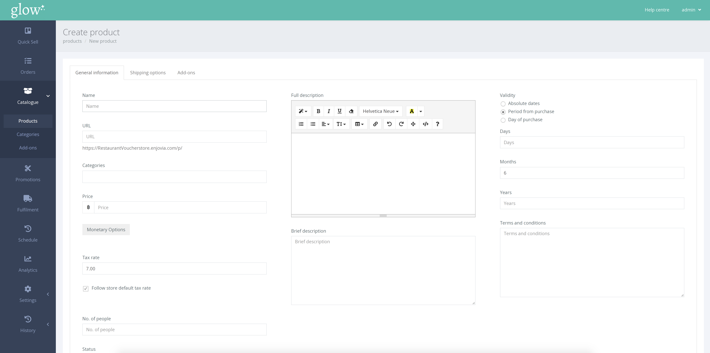

To create a product click CATALOGUE > PRODUCTS from the left hand navigation menu.

The Products Page, as shown above, displays all the products which are currently available. 

To create a new product click [Create]. Doing so opens a new page that will ask for the details of the voucher.

There are a number of fields to take into consideration when creating a voucher. The table below provides a short explanation of each field.

 |  |
--- | ---
**Name** | This is the name of your product, this will be shown on any vouchers as well as on your website.
**URL**| This will be a direct link to your product. You are able to change this manually, although, it will be created by default after inputting the name. 
**Categories**| Here you can assign a category to your product. This will help people to find this product if they decide to filter via categories on your homepage. Find out how to create a category [here](/help/products/creating-a-category/).
**Price**| This will be the price of the product in the currency you have set your store to use by default.
**Monetary**| Create a monetary voucher that will be used as a value in your currency. Learn more about how to do this [here](/help/products/monetary-vouchers/).
**Number of people**| If your product has a maximum or specific number of people that can redeem it, you would define it here. For example, a product called ‘Afternoon Tea for Two’ would have number of people set to ‘2’.
**Status**| **Public** – Your product will be visible and is available for purchase straight away.  **Link Only** – Your product will not show to visitors on your website, it is available for purchase, but only to people that have the direct link to that product.  **Private** – Only staff members can see this product, it can be added to only the staff checkout for purchase.  **Draft** – Product cannot be purchased, it will be saved in the products list in the dashboard for you to edit at a later date.
**Full Description**| This description will be shown on the product’s page, it will not be shown on the homepage(s) inside the product tile.
**Brief Description**| This description will be shown on in the product tile on the homepage(s), it will not be shown on the product’s page.
**Validity**| **Absolute Dates** – Specifies the dates that the voucher will be valid from and until.  **Period from purchase** – Specify a number of days/months/years from the purchase date that the voucher will be valid.
**Terms and conditions**| These terms and conditions are specific to this product and will be shown on the voucher as well as on the product’s page.
**PDF Description**| Overwrites the ‘full description’. This is the description that will appear on the persons voucher.
**PDF Terms and conditions**| Overwrites the ‘terms and conditions’. This is the terms and conditions that will appear on the person’s voucher.

The image uploader allows you to crop and edit images as well as automatically optimising the image for web once you save.

Packaging options or add-on for the product are located at the top of the page in their respective tabs. A more detailed description of packaging options can be found here and help with creating add-ons can be found here.
