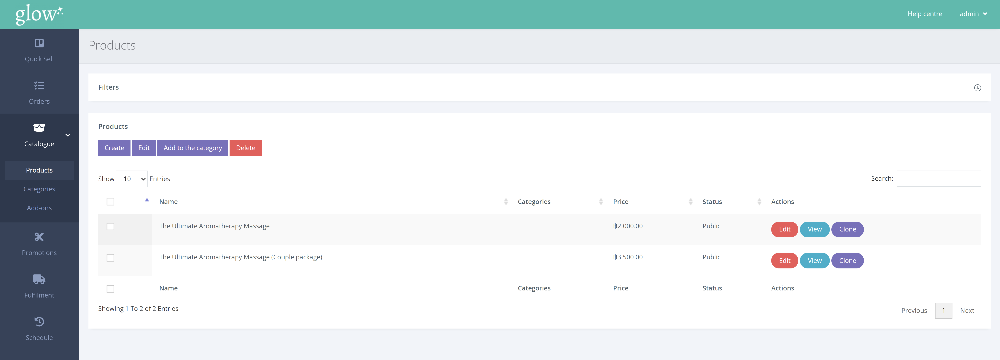
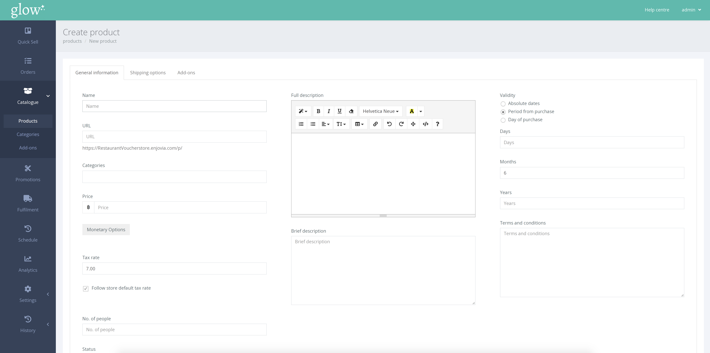

สร้างสินค้าคลิ๊ก CATALOGUE > PRODUCTS จากเมนูด้านซ้ายมือ

หน้าผลิตภัณฑ์ดังที่แสดงด้านบนจะแสดงผลิตภัณฑ์ทั้งหมดที่มีจำหน่ายในปัจจุบัน

หากต้องการสร้างผลิตภัณฑ์ใหม่ ให้คลิก [Create] เพื่อเปิดหน้าใหม่ที่จะถามรายละเอียดของเวาเชอร์

มีหลายฟิลด์ที่ต้องพิจารณาเมื่อสร้างใบสำคัญ ตารางด้านล่างแสดงคำอธิบายสั้น ๆ ของแต่ละฟิลด์

 |  |
--- | ---
**Name** | นี่คือชื่อผลิตภัณฑ์ของคุณ ซึ่งจะแสดงบนบัตรกำนัลใด ๆ รวมทั้งบนเว็บไซต์ของคุณ
**URL**| นี่จะเป็นลิงค์โดยตรงไปยังผลิตภัณฑ์ของคุณ คุณสามารถเปลี่ยนแปลงสิ่งนี้ได้ด้วยตนเอง แม้ว่าจะถูกสร้างขึ้นตามค่าเริ่มต้นหลังจากป้อนชื่อแล้วก็ตาม 
**Categories**| ที่นี่คุณสามารถกำหนดหมวดหมู่ให้กับผลิตภัณฑ์ของคุณได้ ซึ่งจะช่วยให้ผู้คนค้นพบผลิตภัณฑ์นี้หากพวกเขาตัดสินใจที่จะกรองตามหมวดหมู่ในหน้าแรกของคุณ ดูวิธีสร้างหมวดหมู่ได้ [ที่นี่](/help/th/products/creating-a-category/)
**Price**| นี่จะเป็นราคาของผลิตภัณฑ์ในสกุลเงินที่คุณกำหนดให้ร้านค้าของคุณใช้เป็นค่าเริ่มต้น
**Monetary**| สร้างบัตรกำนัลทางการเงินที่จะใช้เป็นมูลค่าในสกุลเงินของคุณ เรียนรู้เพิ่มเติมเกี่ยวกับวิธีการทำเช่นนี้ [ที่นี่](/help/th/products/monetary-vouchers/)
**Number of people**| หากผลิตภัณฑ์ของคุณมีผู้ใช้สูงสุดหรือจำนวนเฉพาะที่สามารถแลกได้ คุณจะต้องกำหนดที่นี่ ตัวอย่างเช่น ผลิตภัณฑ์ชื่อ 'Afternoon Tea for Two' จะกำหนดจำนวนคนเป็น '2'
**Status**| **Public** – ผลิตภัณฑ์ของคุณจะมองเห็นได้และสามารถซื้อได้ทันที  **Link Only** – ผลิตภัณฑ์ของคุณจะไม่แสดงต่อผู้เยี่ยมชมบนเว็บไซต์ของคุณ แต่มีจำหน่ายสำหรับการซื้อ แต่เฉพาะกับผู้ที่มีลิงก์โดยตรงไปยังผลิตภัณฑ์นั้น  **Private** – เฉพาะพนักงานเท่านั้นที่สามารถดูผลิตภัณฑ์นี้ สามารถเพิ่มได้เฉพาะการชำระเงินของพนักงานสำหรับการซื้อ  **Draft** – ไม่สามารถซื้อผลิตภัณฑ์ได้ สินค้าจะถูกบันทึกไว้ในรายการผลิตภัณฑ์ในแดชบอร์ดเพื่อให้คุณแก้ไขในภายหลัง
**Full Description**| คำอธิบายนี้จะแสดงบนหน้าของผลิตภัณฑ์ จะไม่แสดงในหน้าแรกภายในไทล์ผลิตภัณฑ์
**Brief Description**| คำอธิบายนี้จะแสดงบนชื่อผลิตภัณฑ์ในหน้าแรก โดยจะไม่ปรากฏบนหน้าของผลิตภัณฑ์
**Validity**| **Absolute Dates** – ระบุวันที่ที่บัตรกำนัลจะสามารถใช้ได้ตั้งแต่และจนถึง  **Period from purchase** – ระบุจำนวนวัน/เดือน/ปี นับจากวันที่ซื้อที่บัตรกำนัลจะสามารถใช้ได้
**Terms and conditions**| ข้อกำหนดและเงื่อนไขเหล่านี้มีเฉพาะสำหรับผลิตภัณฑ์นี้และจะแสดงบนบัตรกำนัลและในหน้าของผลิตภัณฑ์
**PDF Description**| เขียนทับ 'full description' นี่คือคำอธิบายที่จะปรากฏบนบัตรกำนัลของบุคคล
**PDF Terms and conditions**| เขียนทับ 'terms and conditions' นี่คือข้อกำหนดและเงื่อนไขที่จะปรากฏบนเวาเชอร์ของแต่ละบุคคล

เครื่องมืออัปโหลดรูปภาพช่วยให้คุณสามารถครอบตัดและแก้ไขรูปภาพ รวมทั้งปรับรูปภาพสำหรับเว็บให้เหมาะสมโดยอัตโนมัติเมื่อคุณบันทึก

ตัวเลือกบรรจุภัณฑ์ หรือ ส่วนเสริมสำหรับผลิตภัณฑ์จะอยู่ที่ด้านบนของหน้าในแท็บที่เกี่ยวข้อง สามารถอ่านคำอธิบายโดยละเอียดเพิ่มเติมเกี่ยวกับตัวเลือกบรรจุภัณฑ์ได้ที่นี่ และความช่วยเหลือในการสร้างส่วนเสริมสามารถพบได้ที่นี่
