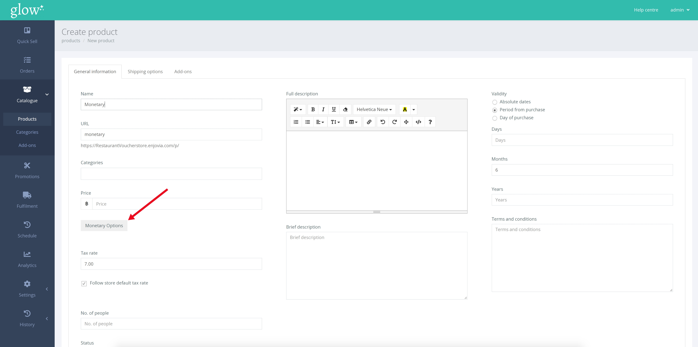
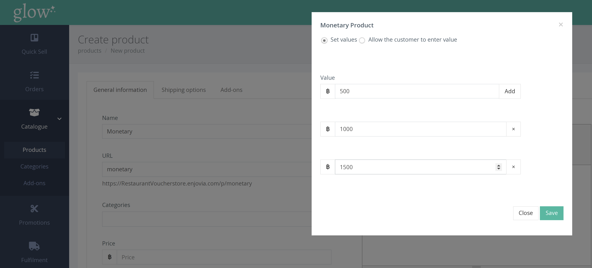

Rather than being purchased for a specific experience, monetary vouchers offer more choice to the customer. It is a fixed ฿ value voucher which can be exchanged for items of equivalent value, at your venue.

Before creating a monetary voucher, you need to create a new product following the steps outlined [here](/help/products/creating-a-product/). Prior to saving, click the [Monetary Options] button.

A pop-up window will appear. You will have the option to select either ‘Set Values’ or ‘Allow the customer to enter value’.

**Set Values** 

This option allows you to offer a list of predetermined voucher prices to the customer. To add a new value, simply click the [Add] button and enter the value. Repeat this process to add multiple values.

**Allow the customer to enter the value** 

This option provides more flexibility to the customer by allowing them to determine their own price. If you wish, you can enter a ‘minimum value’ and/or a ‘maximum value’ that the customer can purchase in a single voucher, before clicking [Save]

