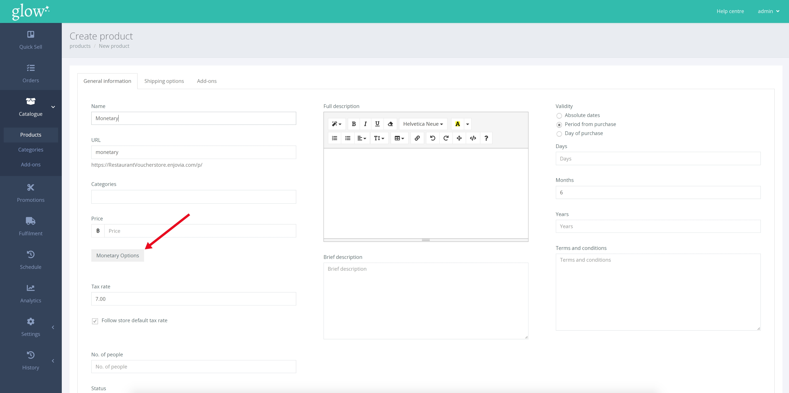
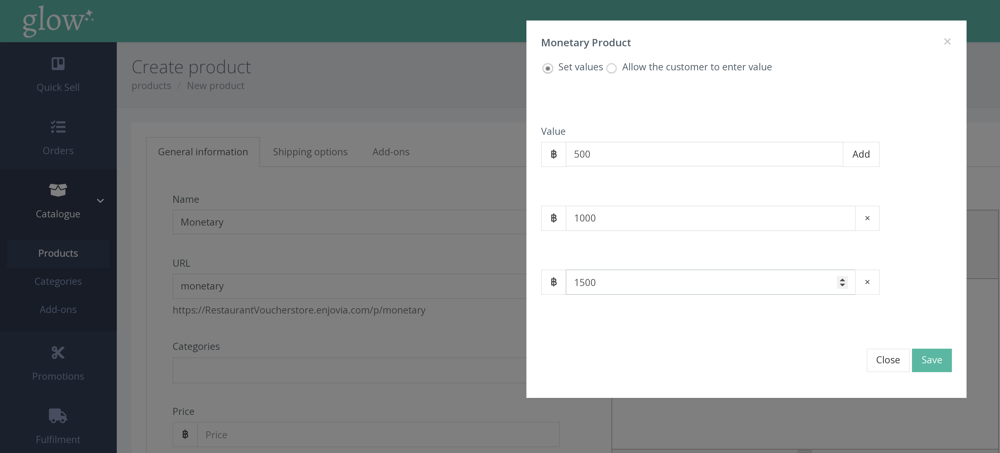
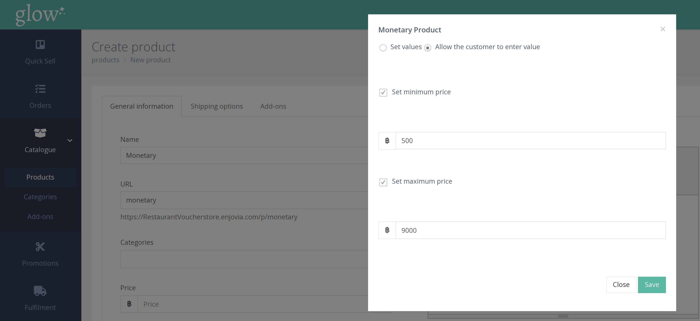

แทนที่จะซื้อเพื่อประสบการณ์เฉพาะ บัตรกำนัลทางการเงินเสนอทางเลือกให้กับลูกค้ามากขึ้น เป็นเวาเชอร์มูลค่า ฿ คงที่ ซึ่งสามารถแลกเปลี่ยนเป็นสินค้าที่มีมูลค่าเทียบเท่าได้ ณ สถานที่ของคุณ

ก่อนสร้างบัตรกำนัลทางการเงิน คุณต้องสร้างผลิตภัณฑ์ใหม่โดยทำตามขั้นตอนที่อธิบายไว้ [ที่นี่](/help/th/products/creating-a-product/) ก่อนบันทึก ให้คลิกปุ่ม [Monetary Options]

หน้าต่างป๊อปอัปจะปรากฏขึ้น คุณจะมีตัวเลือก ให้เลือก 'Set Values' หรือ 'Allow the customer to enter value'

**การตั้ง Values** 

ตัวเลือกนี้ช่วยให้คุณสามารถเสนอรายการราคาบัตรกำนัลที่กำหนดไว้ล่วงหน้าแก่ลูกค้าได้ หากต้องการเพิ่มค่าใหม่ เพียงคลิกปุ่ม [Add] และป้อนค่า ทำขั้นตอนนี้ซ้ำเพื่อเพิ่มค่าหลายค่า

**ให้ลูกค้ากรอกค่าที่ต้องการ** 

ตัวเลือกนี้ให้ความยืดหยุ่นมากขึ้นแก่ลูกค้าโดยอนุญาตให้พวกเขากำหนดราคาของตนเอง หากต้องการ คุณสามารถป้อน 'minimum value' และ/หรือ 'maximum value' ที่ลูกค้าสามารถซื้อได้ในเวาเชอร์เดียว ก่อนคลิก [Save]

