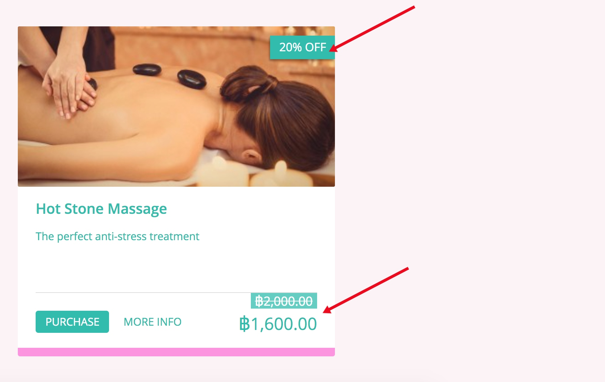
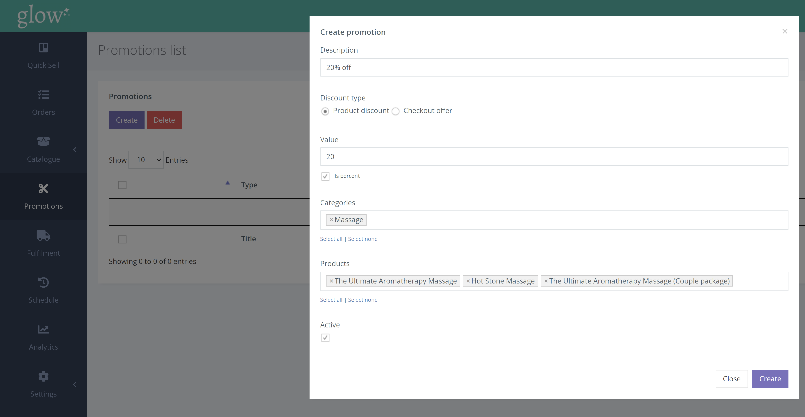
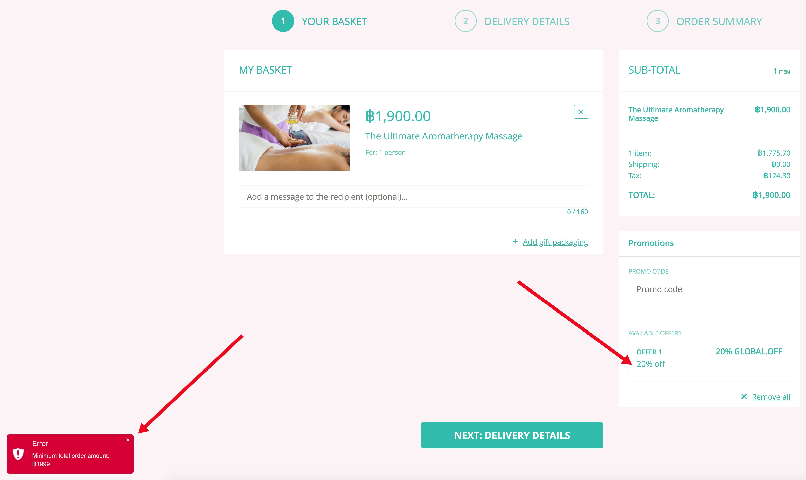
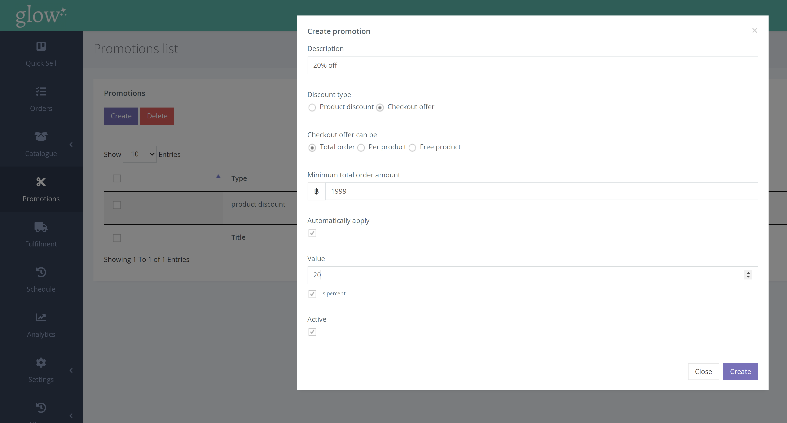

An automatic discount is a discount that is applied without the need to enter a promo code.

Discounts can either be automatically applied via the product, or the discount can be applied at the checkout.

**Product Discount** 

A product discount will automatically display (a) previous price, (b) discount percentage/value and (c) new price. This will be shown on the product page and the product tile as seen below.

To create a product discount;

1. Click PROMOTIONS from the left hand navigation.
2. Click the [Create] tab
3. Select ‘product discount’ and fill in the details of the promotion.

**Checkout Discount** 

A checkout discount is only shown at the checkout stage.

If the user has not met the criteria, the discount will still appear as an option that would be ‘available’ (without it being applied or reducing the price). If the user clicks on it, they will be informed why they aren’t able to use the offer.
In this case, the ฿1900 product did not meet the criteria of having to spend ฿1999 or more.

**To create a checkout discount;** 

1. Click PROMOTIONS from the left hand navigation.
2. Click the [Create] tab
3. Select ‘checkout discount’ and fill in the details of the promotion.

