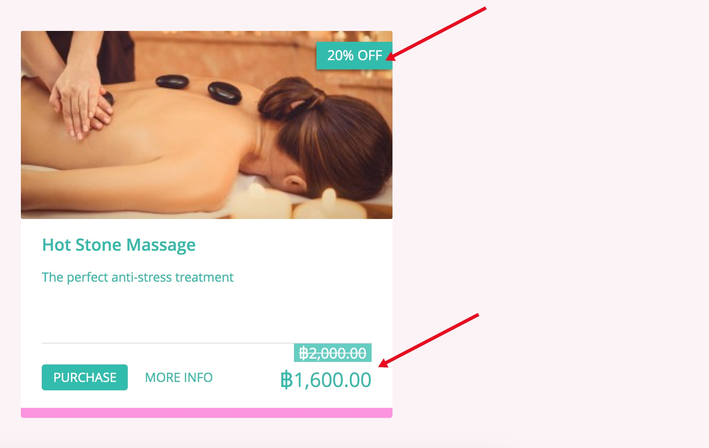

ส่วนลดอัตโนมัติ คือ ส่วนลดที่ใช้โดยไม่จำเป็นต้องป้อนรหัสโปรโมชั่น

สามารถใช้ส่วนลดได้โดยอัตโนมัติผ่านผลิตภัณฑ์ หรือ สามารถใช้ส่วนลดได้เมื่อชำระเงิน

**ส่วนลดสินค้า** 

ส่วนลดสินค้าจะแสดงโดยอัตโนมัติ (a) ราคาก่อนหน้า (b) เปอร์เซ็นต์ส่วนลด/มูลค่าส่วนลด และ (c) ราคาใหม่ ซึ่งจะแสดงในหน้าผลิตภัณฑ์และไทล์ผลิตภัณฑ์ตามที่แสดงด้านล่าง

เพื่อสร้างส่วนลดสินค้า

1. คลิก PROMOTIONS จากแถบทางด้านซ้ายมือ

2. คลิกแท็บ [Create]

3. เลือก 'product discount' และกรอกรายละเอียดของโปรโมชั่น

**ส่วนลดการชำระเงิน** 

ส่วนลดการชำระเงินจะแสดงที่ขั้นตอนการชำระเงินเท่านั้น

If the user has not met the criteria, the discount will still appear as an option that would be ‘available’ (without it being applied or reducing the price). If the user clicks on it, they will be informed why they aren’t able to use the offer.
In this case, the ฿1900 product did not meet the criteria of having to spend ฿1999 or more.

**To create a checkout discount;** 

1. Click PROMOTIONS from the left hand navigation.
2. Click the [Create] tab
3. Select ‘checkout discount’ and fill in the details of the promotion.

