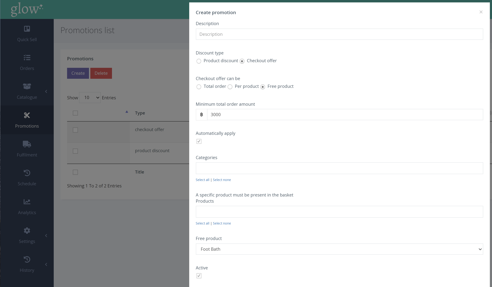

ทำตามขั้นตอนด้านล่างเพื่อเพิ่มผลิตภัณฑ์ฟรีที่จุดชำระเงิน

1. จากเมนูด้านซ้ายมือให้ คลิก PROMOTIONS

2. คลิกแท็บ [Create]

3. เลือก 'Checkout offer' จากนั้นเลือก 'Free Product'

4. จากนั้นคุณจะถูกขอให้ระบุเกณฑ์คุณสมบัติ รวมถึงจำนวนการสั่งซื้อขั้นต่ำทั้งหมด หรือ หมวดหมู่ที่เกี่ยวข้อง หรือ ผลิตภัณฑ์เฉพาะที่ต้องอยู่ในตะกร้า

5. สุดท้ายเลือกผลิตภัณฑ์ฟรีจากรายการผลิตภัณฑ์ของคุณและคลิก [Create]

