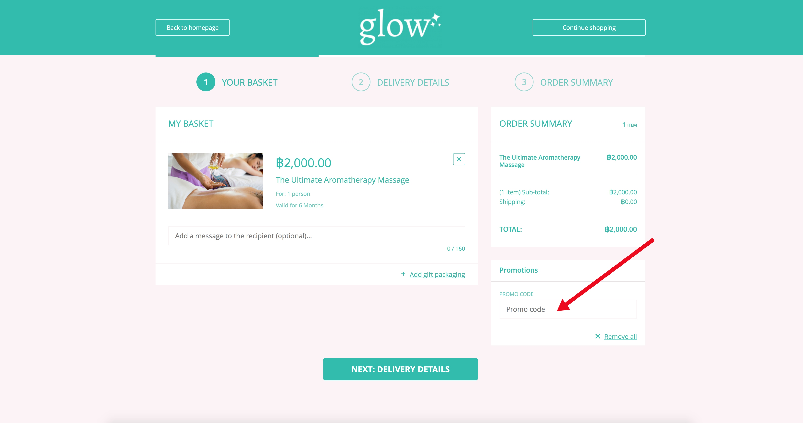

**What is a Promo Code?** 

A Promo Code is a type of promotion that involves the customer entering a code at the checkout page in order to receive a discount or a free product.

You can set qualifying criteria, for example Minimum Spend. And offer either percentage or monetary discount values.

**Creating a Promo Code** 

1. Click on PROMOTIONS from the left hand navigation.

2. On the Promotions List page click [Create] to display the Create Promotion popup.

3. On the promotions popup select ‘Checkout Offer’ and make sure to uncheck ‘Automatically Apply’.

4. Next input a short description of the promotion and enter a chosen promo code.

5. You now have 3 checkout offers to select from;

‘Total order’ is a discount that applies to the total order value, including add-ons and shipping.

‘Per product’ is a discount applied to a specific product only.

‘Free Product’ is described in more detail [here](/promotions/free-products/).

6. Depending on which of the above checkout offers you choose, complete the corresponding fields and click [Create] to save the promo code.
