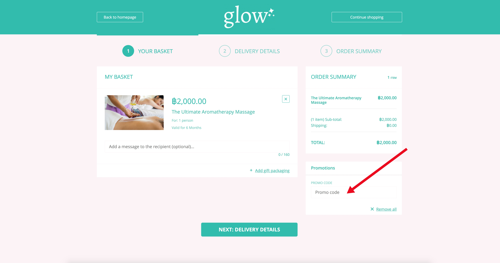
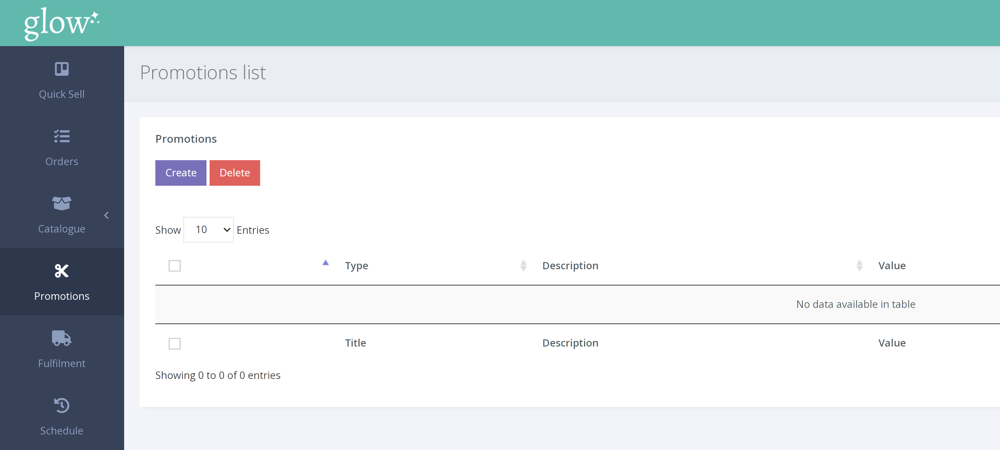
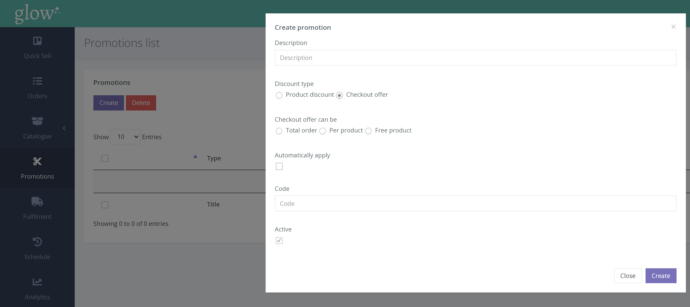

**รหัสโปรโมชั่นคืออะไร ?** 

รหัสโปรโมชั่น คือ ประเภทของโปรโมชั่นที่เกี่ยวข้องกับการที่ลูกค้าป้อนรหัสที่หน้าชำระเงินเพื่อรับส่วนลดหรือ สินค้าฟรี

คุณสามารถกำหนดเกณฑ์คุณสมบัติได้ ตัวอย่าง เช่น การซื้อขั้นต่ำ และเสนอมูลค่าส่วนลดเป็นเปอร์เซ็นต์หรือ เป็นเงิน

**การสร้างรหัสโปรโมชั่น** 

1. คลิกโปรโมชั่นจากเมนูด้านซ้ายมือ

2. ในหน้ารายการโปรโมชั่นให้ คลิก [Create] เพื่อแสดงป๊อปอัปสร้างโปรโมชัน

3. ในป๊อปอัปโปรโมชั่น ให้เลือก 'Checkout Offer' และ อย่าลืมยกเลิกการเลือก 'Automatically Apply'

4. ถัดไปป้อนคำอธิบายสั้น ๆ ของโปรโมชั่น และป้อนรหัสโปรโมชั่นที่เลือก

5. ตอนนี้คุณมีข้อเสนอการชำระเงิน 3 รายการให้เลือก;

'Total order' คือ ส่วนลดที่ใช้กับมูลค่าการสั่งซื้อทั้งหมด รวมถึงส่วนเสริมและการจัดส่ง

'Per product' คือ ส่วนลดที่ใช้กับผลิตภัณฑ์เฉพาะเท่านั้น

'Free Product' มีรายละเอียดเพิ่มเติม [ที่นี่](/help/th/promotions/free-products/)

6. กรอกข้อมูลในช่องที่เกี่ยวข้องและคลิก [Create] เพื่อบันทึกรหัสโปรโมชั่น ทั้งนี้ขึ้นอยู่กับข้อเสนอการชำระเงินด้านบนที่คุณเลือก
