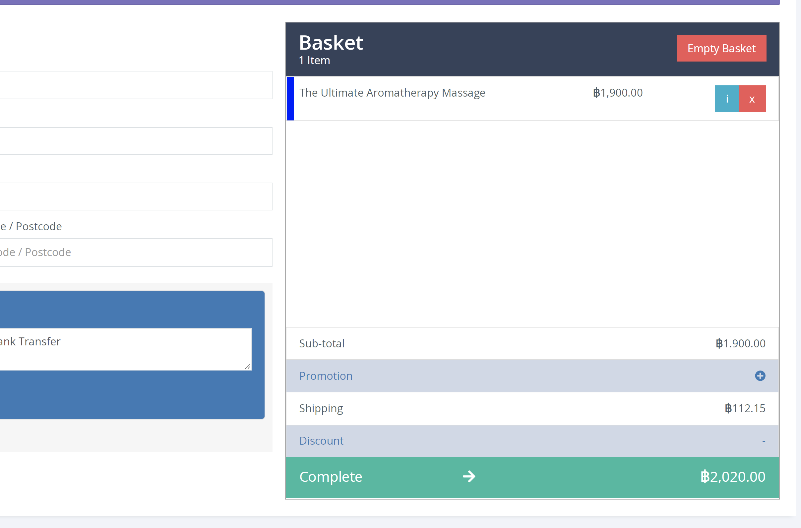
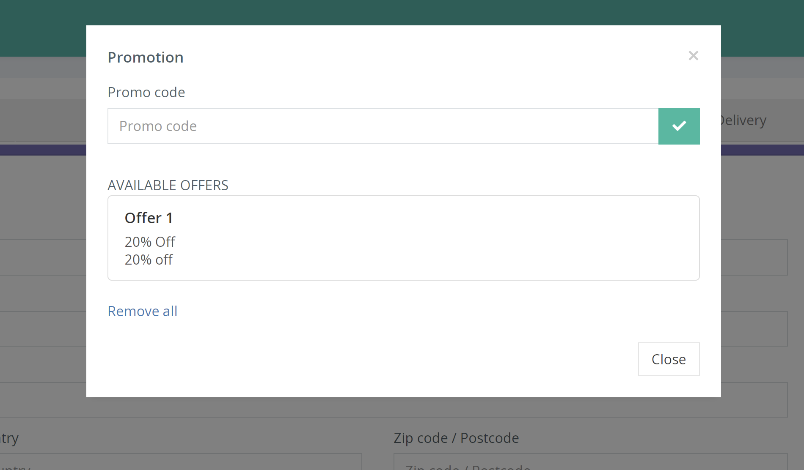
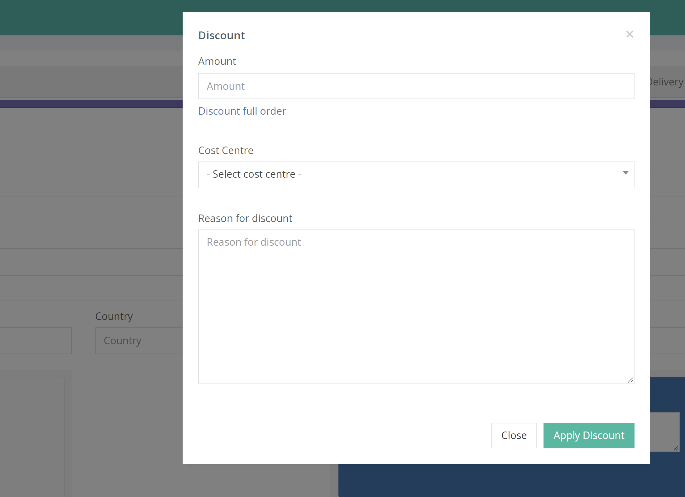

As you process an order through the Quick Sell page it is possible to apply additional discounts (if the user role has permission). This is done on the basket page when clicking ‘Promotion or ‘Discount’.

Promotion opens a popup which enables you to apply an active-existing coupon code. As shown below.

Whereas Discount opens a popup which allows you to apply a monetary value discount of your choice. Like the example beneath.

