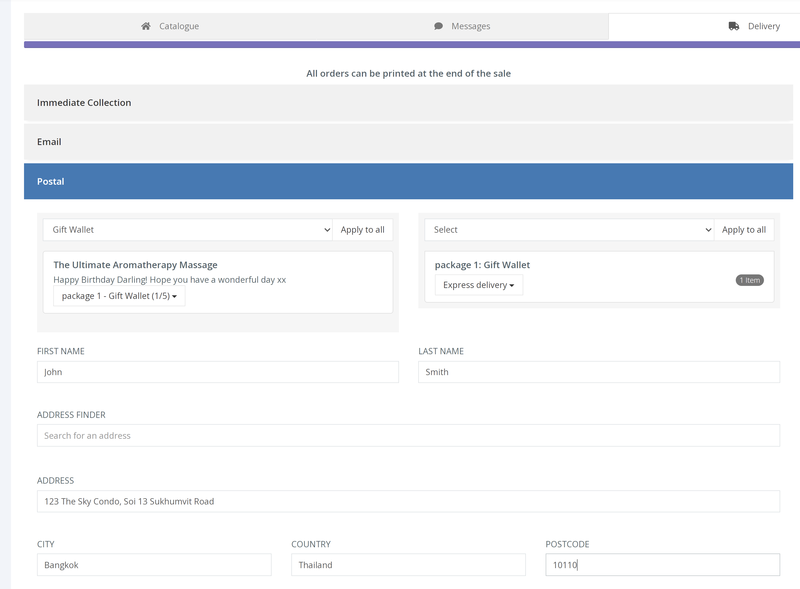

Quick Sell allows you to purchase vouchers through the dashboard, on behalf of the customer. This can be over the phone or face-to-face at your venue. Furthermore, Quick Sell lets you accept payments outside of the Voucherstore system, for example cash or bank transfer.

There are four different steps when placing a QUICK SELL order.

**1. Catalogue** 
Under the [Catalogue] tab you can search through all existing products and use the [Add] button to add products to the basket.

**2. Messages** 
The [Message] tab allows you to add a personal message to the recipient on behalf of the customer. You can add a message to each product within the order. The message is shown on the voucher once it is downloaded/printed.

**3. Delivery** 
Under the [Delivery] tab you select how the customer will receive their voucher(s).

Depending on the specific pre-set fulfilment options available on your products. You will be prompted to select one of the below fulfilment options.

[Immediate Collection] should be used for face-to-face sales and you would print out the Voucher and receipt at the end of the sale.

[Email] requires the recipient's email address and the voucher will be sent automatically after confirming payment.

When selecting [Postal], you are prompted to pick a packaging option as well as the shipping type for the order.

**4. Payment** 
Finally, the [Payment] tab opens a page which allows you to add any discounts or promo codes to the order. Before choosing a payment method.

[Pay by card] allows you to accept a credit card payment through the Voucherstore system.

Whereas [Offline Sale] allows you to receive alternative payments such as cash or a bank transfer, through your own internal payment system.

