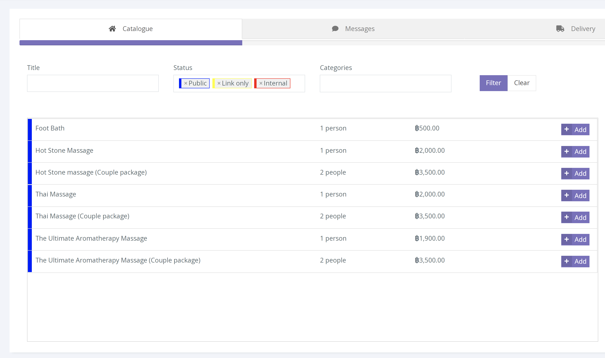
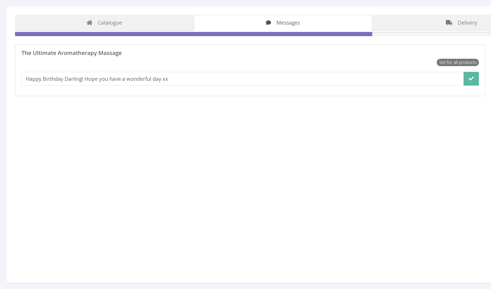
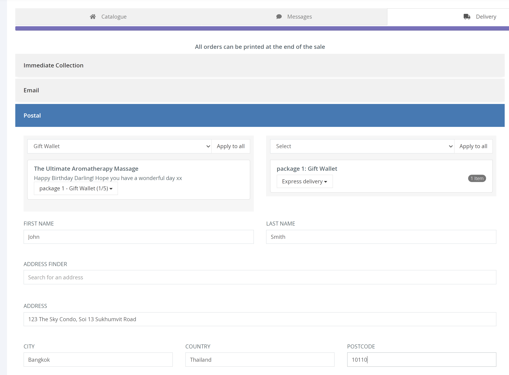
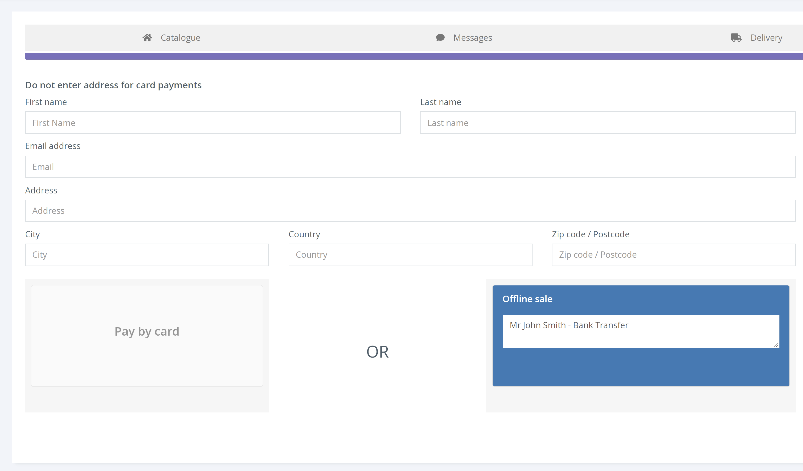

การขายด่วนทำให้คุณสามารถซื้อบัตรกำนัลผ่านแดชบอร์ดในนามของลูกค้าได้ สามารถทำได้ทางโทรศัพท์หรือ แบบเห็นหน้ากันในสถานที่ของคุณ นอกจากนี้ Quick Sell ยังให้คุณรับการชำระเงินนอกระบบ Voucherstore เช่น เงินสด หรือ การโอนเงินผ่านธนาคาร

มีสี่ขั้นตอนที่แตกต่างกันเมื่อวางคำสั่งซื้อขายด่วน

**1. Catalogue** 

ใต้แท็บ [Catalogue] คุณสามารถค้นหาผลิตภัณฑ์ที่มีอยู่ทั้งหมด และใช้ปุ่ม [Add] เพื่อเพิ่มสินค้าลงในตะกร้า

**2. Messages** 

แท็บ [Message] ให้คุณเพิ่มข้อความส่วนตัวถึงผู้รับในนามของลูกค้า คุณสามารถเพิ่มข้อความไปยังแต่ละผลิตภัณฑ์ภายในคำสั่งซื้อได้ ข้อความจะปรากฏบนบัตรกำนัลเมื่อดาวน์โหลด/พิมพ์แล้ว

**3. Delivery** 

ใต้แท็บ [Delivery] คุณจะเลือกวิธีที่ลูกค้าจะได้รับบัตรกำนัลของตน

ขึ้นอยู่กับตัวเลือกการเติมสินค้าที่กำหนดไว้ล่วงหน้าเฉพาะที่มีอยู่ในผลิตภัณฑ์ของคุณ คุณจะได้รับข้อความให้เลือกหนึ่งในตัวเลือกการปฏิบัติตามด้านล่าง

[Immediate Collection] ควรใช้สำหรับการขายแบบเห็นหน้ากัน และคุณจะต้องพิมพ์คูปองและใบเสร็จรับเงินเมื่อสิ้นสุดการขาย

[Email] ต้องการที่อยู่อีเมลของผู้รับ และบัตรกำนัลจะถูกส่งโดยอัตโนมัติหลังจากยืนยันการชำระเงิน

เมื่อเลือก [Postal] คุณจะได้รับแจ้งให้เลือกตัวเลือกบรรจุภัณฑ์และประเภทการจัดส่งสำหรับคำสั่งซื้อ

**4. Payment** 

สุดท้าย แท็บ [Payment] จะเปิดหน้าซึ่งช่วยให้คุณสามารถเพิ่มส่วนลด หรือ รหัสโปรโมชั่นในคำสั่งซื้อได้ ก่อนเลือกวิธีการชำระเงิน

[Pay by card] อนุญาตให้คุณรับชำระเงินด้วยบัตรเครดิตผ่านระบบ Voucherstore

ในขณะที่ [Offline Sale] อนุญาตให้คุณรับการชำระเงินทางเลือก เช่น เงินสด หรือ การโอนเงินผ่านธนาคาร ผ่านระบบการชำระเงินภายในของคุณเอง

