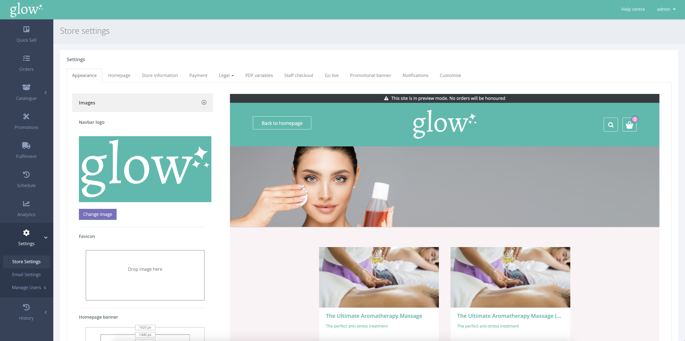

Favicon คือ ไอคอนที่จะปรากฏในแท็บเบราว์เซอร์ของคุณ

นี่จะต้องเป็นไฟล์ jpg, png หรือ ico และมีความสูง และความกว้างเท่ากัน

(*ต้องไม่เกิน 100×100 พิกเซล)

หากต้องการ เพิ่ม/แก้ไข ไอคอน Fav ให้คลิก SETTINGS > STORE SETTINGS จากการนำทางด้านซ้ายมือ

ในหน้าการตั้งค่าร้านค้า ให้เลือกแท็บ [Appearance] จากนั้นเลือกรายการแบบเลื่อนลง [Images]

จากนั้นคุณสามารถคลิกที่กล่องรูปภาพ [Favicon] และ เลือก favicon ของคุณ หรือ ลากและวางรูปภาพของคุณลงในกล่องหลังจากที่คุณบันทึกการเปลี่ยนแปลง favicon จะมีผล
