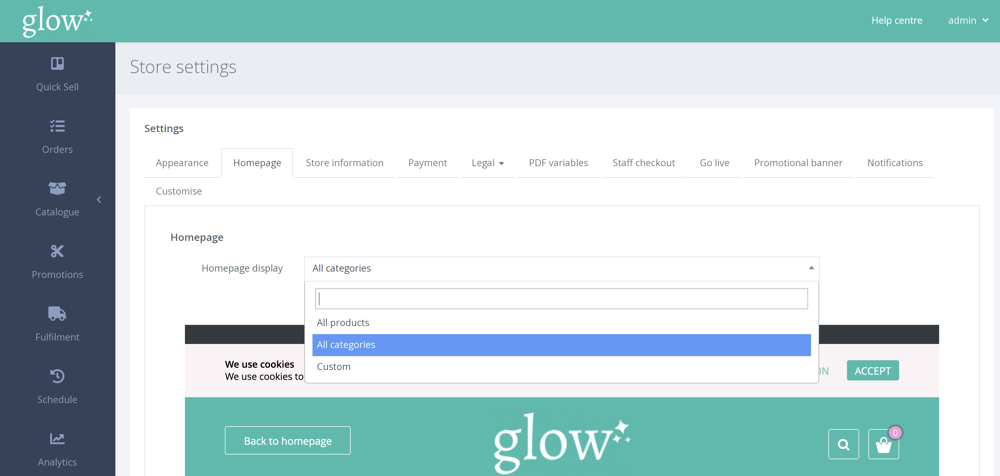
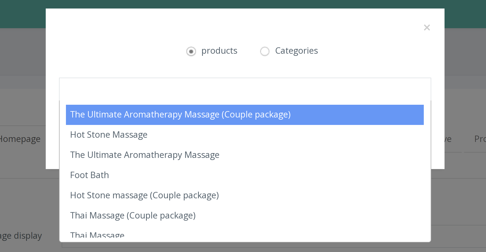

There are a number of different ways to display products or categories on your homepage.

From the left hand navigation click SETTINGS > STORE SETTINGS.

On the Store settings page select the [Homepage] tab.

From the drop down box you can select the homepage display type.

**Show Only Products** 
This is the default setting and displays each individual product (voucher) on your homepage. You can drag and drop products into your preferred position.

**Show Only Categories** 
This display shows each category as a tile. After clicking on a category tile, the products within that category are displayed on a new page. You can drag and drop categories into your preferred position.

**Custom** 
Custom homepage display allows you to show a mixture of both categories and products on your homepage. You can click the [+] tile to add a new product or category, before drag and drop into your preferred order.

