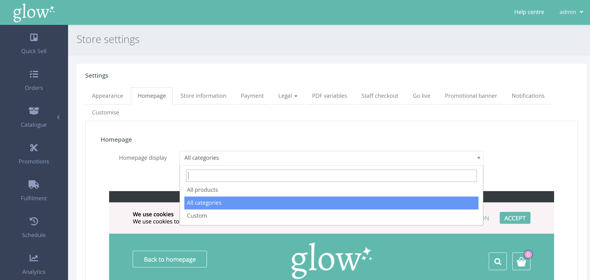

มีหลายวิธีในการแสดงผลิตภัณฑ์ หรือ หมวดหมู่ในหน้าแรกของคุณ

จากเมนูด้านซ้ายมือให้คลิก SETTINGS > STORE SETTINGS

ในหน้า การตั้งค่าร้านค้า ให้เลือกแท็บ [Homepage]

จากกล่องดรอปดาวน์ คุณสามารถเลือกประเภทการแสดงในหน้าแรกได้

**แสดงเฉพาะสินค้า** 

นี่คือการตั้งค่าเริ่มต้น และแสดงผลิตภัณฑ์แต่ละรายการ (บัตรกำนัล) บนหน้าแรกของคุณ คุณสามารถลากและวางสินค้าในตำแหน่งที่คุณต้องการได้

**แสดงเฉพาะหมวดหมู่** 

การแสดงผลนี้ แสดงแต่ละหมวดหมู่หลังจากคลิกผลิตภัณฑ์ภายในประเภทนั้น จะแสดงบนหน้าใหม่ คุณสามารถลาก และวางหมวดหมู่ลงในตำแหน่งที่คุณต้องการได้

**ปรับแต่งตามความต้องการ** 

การแสดงหน้าแรกแบบกำหนดเองทำให้คุณสามารถแสดงทั้งหมวดหมู่ และผลิตภัณฑ์ในหน้าแรกของคุณได้ คุณสามารถคลิก [+] เพื่อเพิ่มผลิตภัณฑ์ หรือ หมวดหมู่ใหม่ ก่อนลากและวางลงในคำสั่งซื้อที่คุณต้องการ

