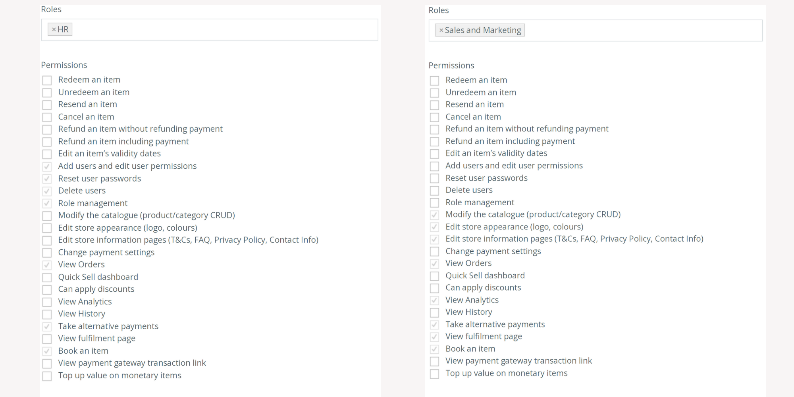
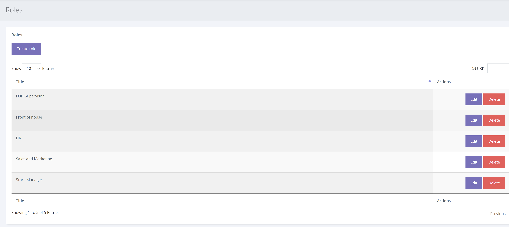
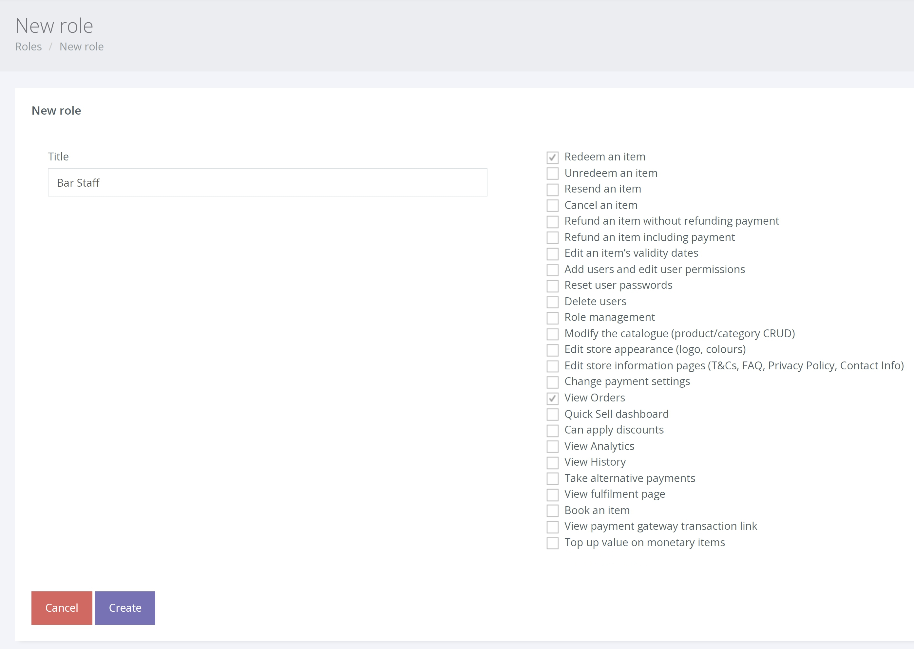

A role is a pre-set permission(s) that has been assigned a name (such as ‘Sales and Marketing') and is saved for use when creating new manager accounts.

Below is an example of the 'HR' and 'Sales and Marketing' pre-set roles. You can use the Voucherstore pre-set roles or create roles for each user.

Creating a role

1. To create a role, click SETTINGS > MANAGE USERS > ROLES from the left hand navigation.

2. You will now see a list of all the current roles (which you can edit) and the option to [Create Role], click this button.

In the example below, we will create a new role for ‘Bar Staff’ that will allow this user type to view an order and redeem an order.

Note: View orders must always be ticked to allow a user type to redeem a voucher.

Once saved, you will be able to use this new role when [creating](/help/users/managing-users/) additional ‘Bar Staff’ accounts.
