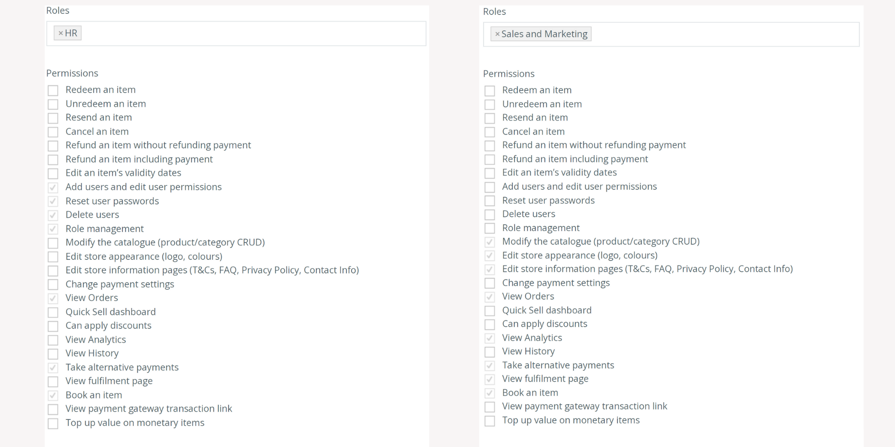
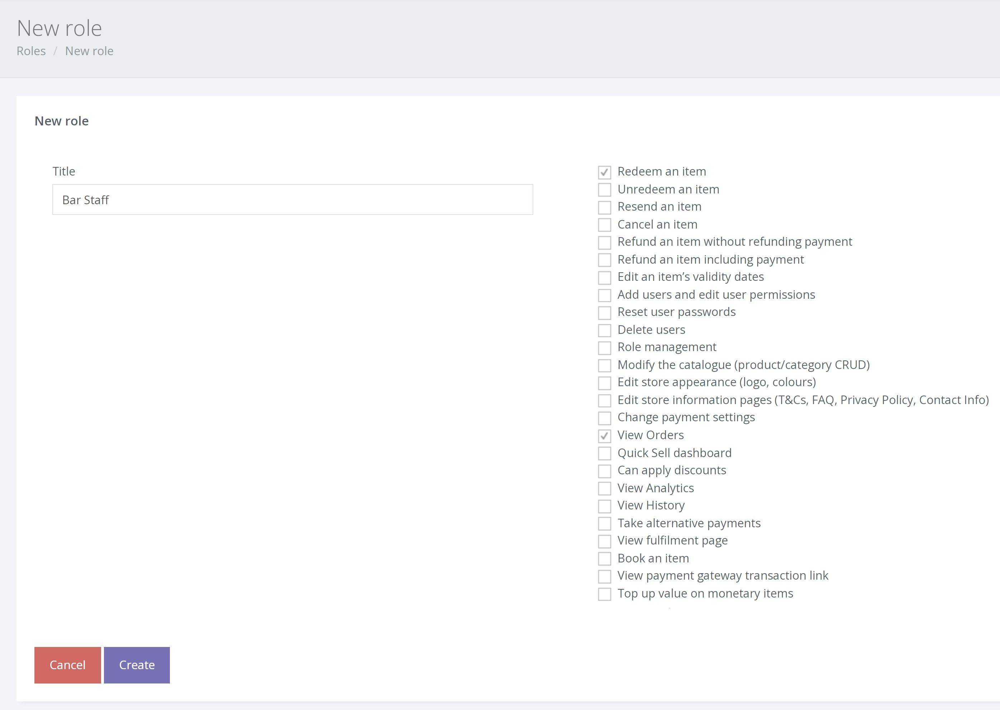

บทบาท คือ สิทธิ์ที่กำหนดไว้ล่วงหน้า ซึ่งได้รับการกำหนดชื่อ เช่น ("Sales and Marketing") และบันทึกไว้เพื่อใช้ในการสร้างบัญชีผู้จัดการใหม่

ด้านล่างนี้เป็นตัวอย่างของบทบาทที่กำหนดไว้ล่วงหน้า 'HR' และ 'Sales and Marketing' คุณสามารถใช้บทบาทที่กำหนดไว้ล่วงหน้าของ Voucherstore หรือ สร้างบทบาทสำหรับผู้ใช้แต่ละราย

**การสร้างบทบาท** 

1. ในการสร้างบทบาท คลิก SETTINGS > MANAGE USERS > ROLES จากการนำเมนูด้านซ้ายมือ

2. ตอนนี้คุณจะเห็นรายการบทบาทปัจจุบันทั้งหมด (ซึ่งคุณสามารถแก้ไขได้) และตัวเลือก [Create Role] ให้คลิกปุ่มนี้

ในตัวอย่างด้านล่าง เราจะสร้างบทบาทใหม่สำหรับ "พนักงานบาร์" ซึ่งจะอนุญาตให้ผู้ใช้ประเภทนี้ดูคำสั่งซื้อและแลกคำสั่งซื้อได้

หมายเหตุ: ต้องเลือกดูคำสั่งซื้อเสมอเพื่อให้ผู้ใช้พิมพ์เพื่อแลกรับบัตรกำนัล

เมื่อบันทึกแล้ว คุณจะสามารถใช้บทบาทใหม่นี้ [เมื่อสร้างบัญชี](/th/users/managing-users/) "Bar Staff" เพิ่มเติม
