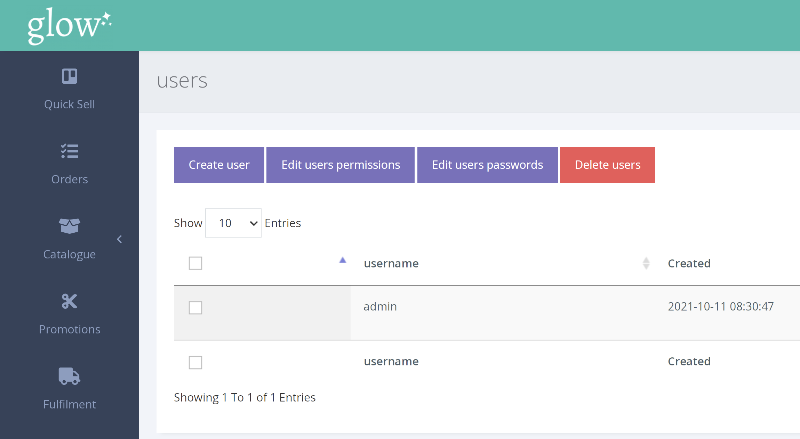

Voucherstore allows you to create, delete or modify accounts for your team members.

**To manage users** 

1. Click SETTINGS > MANAGE USERS > USERS from the left hand navigation.

2. To create a new user, click the [User] button and the following page will appear:

Voucherstore already has preset permissions for default roles. If you want to edit these permissions, or create a custom role, [read this article first](/users/managing-roles/).

3. Otherwise, select the permissions you want to enable for the new user, fill in their username and password, and then click [Create].
