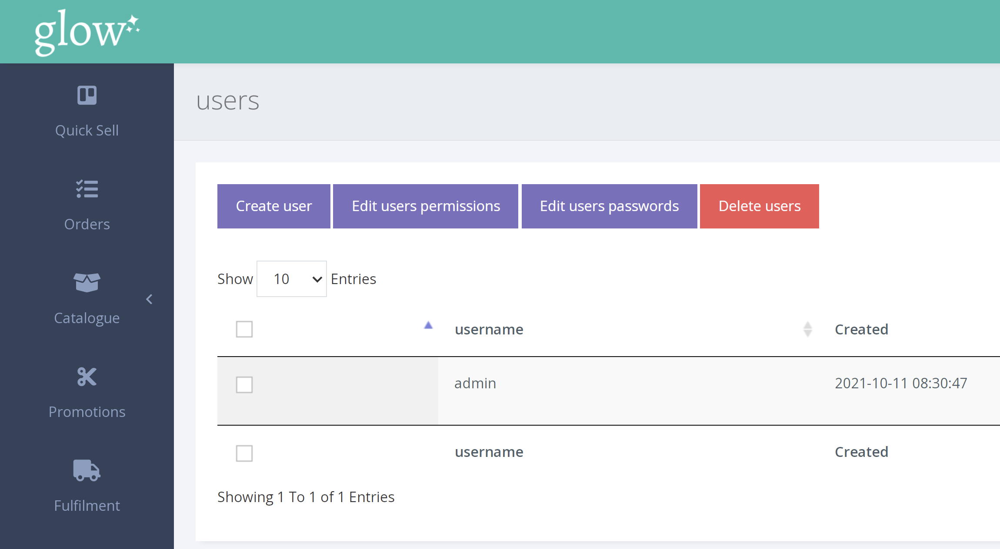
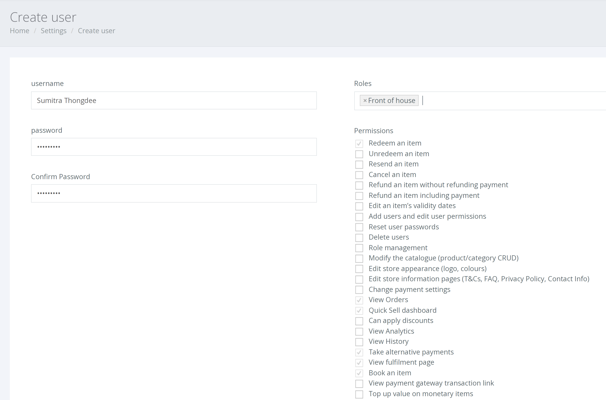

Voucherstore ช่วยให้คุณสร้าง ลบ หรือ แก้ไขบัญชี สำหรับสมาชิกในทีมของคุณ

**เพื่อจัดการผู้ใช้** 

1. คลิก SETTINGS > MANAGE USERS > USERS จากเมนูซ้ายมือ

2. ในการสร้างผู้ใช้ใหม่ให้ คลิกปุ่ม [User] และหน้าต่อไปนี้จะปรากฏขึ้น

Voucherstore มีสิทธิ์ที่กำหนดไว้ล่วงหน้าสำหรับบทบาทเริ่มต้นแล้ว หากคุณต้องการแก้ไขสิทธิ์เหล่านี้ หรือสร้างบทบาทที่กำหนดเอง โปรดอ่าน [บทความ](/th/users/managing-roles/) นี้ก่อน

3. มิฉะนั้น เลือกการอนุญาตที่คุณต้องการเปิดใช้งานสำหรับผู้ใช้ใหม่ กรอกชื่อผู้ใช้และรหัสผ่าน จากนั้นคลิก [Create]
