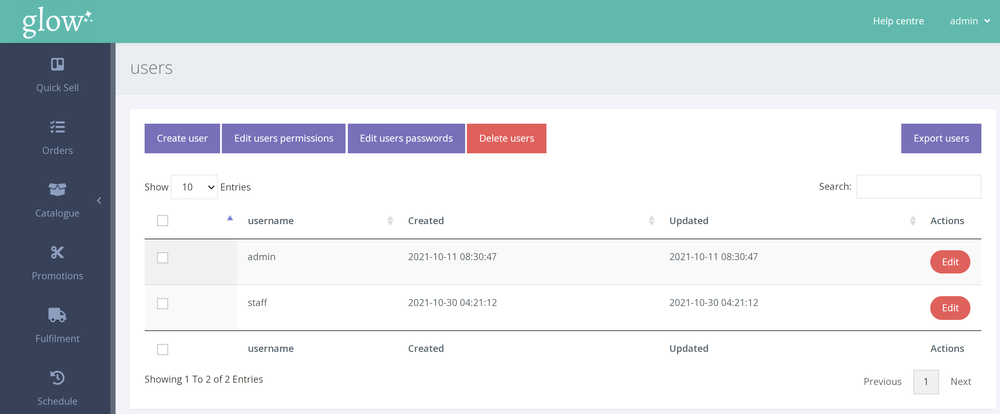
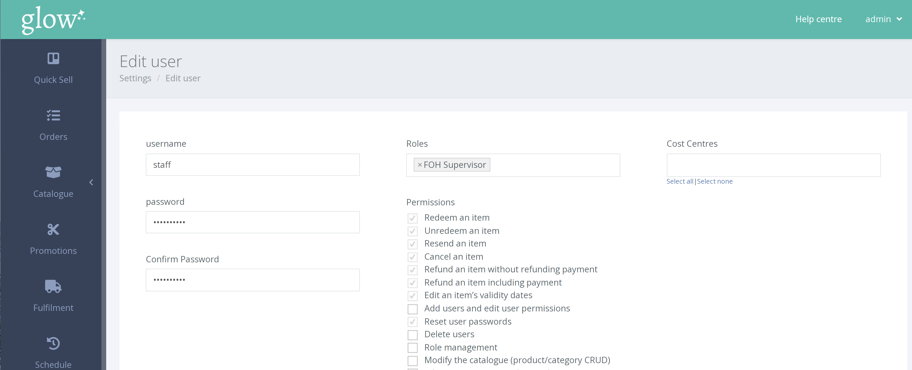

Note; To reset a (staff) user's password, you must have the appropriate ‘user permissions’.

From the left hand navigation click SETTINGS > MANAGE USERS > USERS

From the user page click [Edit] on the appropriate user.

Enter the new password twice and click [Edit user] to confirm the password change.

