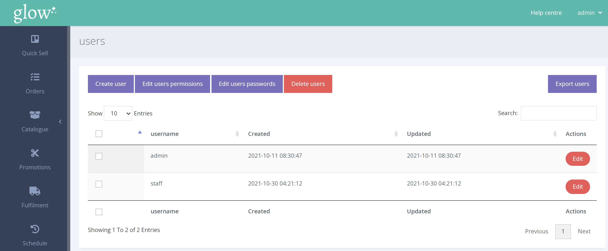
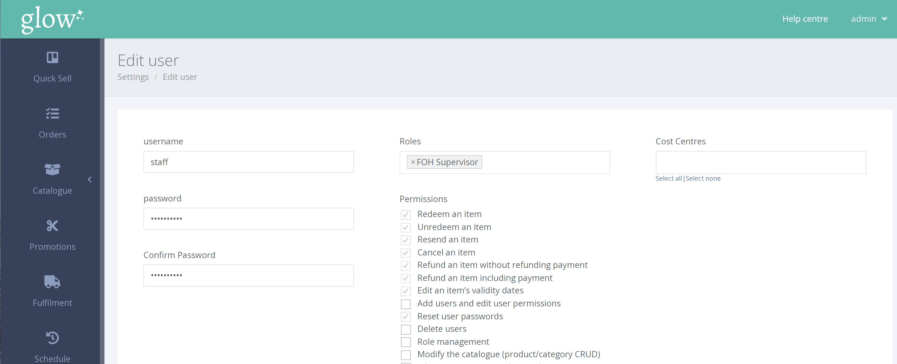

บันทึก; ในการรีเซ็ตรหัสผ่านของผู้ใช้ (พนักงาน) คุณต้องมี 'user permissions' ที่เหมาะสม

จากเมนูด้านซ้ายมือ ให้คลิก SETTINGS > MANAGE USERS > USERS

จากหน้าผู้ใช้ คลิก [Edit] กับผู้ใช้ที่เหมาะสม

ป้อนรหัสผ่านใหม่สองครั้งแล้วคลิก [Edit user] เพื่อยืนยันการเปลี่ยนรหัสผ่าน

