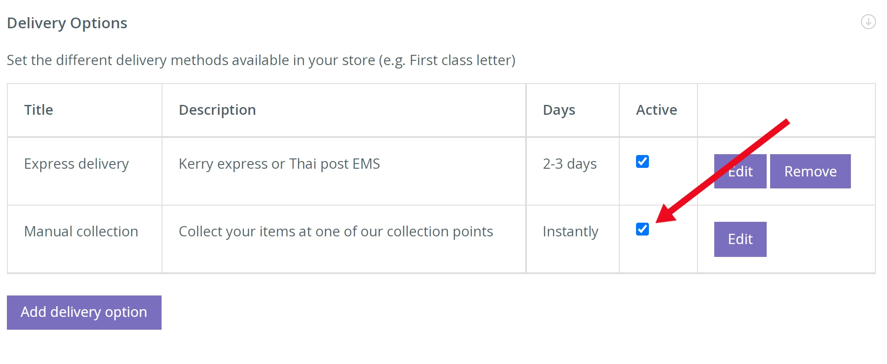
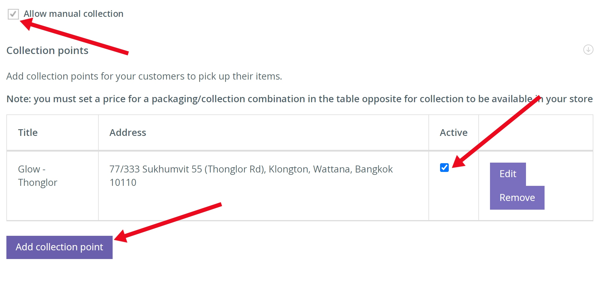
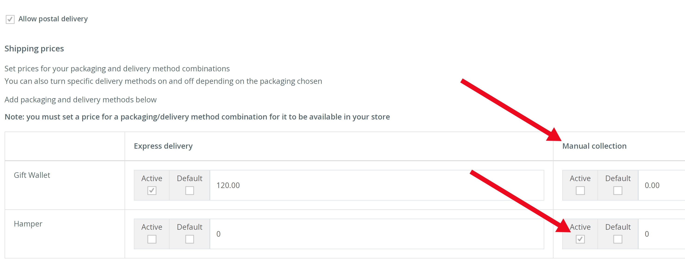

**What is ‘Collection’?** 
Collection is a fulfilment option allowing a customer to place an order which they will pick up from a specified collection point. This could be a voucher, or even a bulky item such as a luxury food & beverage hamper.

**To enable collection** 

1. From the left hand navigation click FULFILMENT > [Fulfilment options]

Here you will find all of the options for the fulfilment of your store.

2. Expand the [Delivery options] tab and select the ‘Manual collection’ check box to activate.

3. Under the [Collection points] tab Select the ‘Allow manual collection’ check box and then click [Add a collection point] and proceed to add the locations.

4. Make sure that you have at least one packaging option active, then go to the top of the page where it is showing the [Shipping Prices].

5. Select the ‘Active’ checkbox and input ‘0’ if you want manual collection to be free of charge to the customer, otherwise enter a price.
