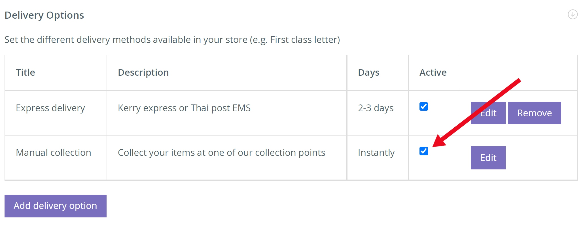

**'Collection' คืออะไร?** 

Collection เป็นตัวเลือกในการดำเนินการที่ช่วยให้ลูกค้าสามารถสั่งซื้อ ซึ่งพวกเขาจะไปรับจากจุดรับสินค้าที่ระบุ นี่อาจเป็นบัตรกำนัล หรือ สิ่งของขนาดใหญ่ เช่น กระเช้าอาหาร และเครื่องดื่มสุดหรู

**เพื่อเปิดใช้งานระบุจุดรับด้วยตนเอง (Manual collection)** 

1. จากการนำทางด้านซ้ายมือ ให้คลิก FULFILMENT > [Fulfilment options]

ที่นี่คุณจะพบกับตัวเลือกทั้งหมดสำหรับ fulfilment ร้านค้าของคุณ

2. ขยายแท็บ [Delivery options] และเลือกกล่องกาเครื่องหมาย 'Manual collection' เพื่อเปิดใช้งาน

3. ใต้แท็บ [Collection points] เลือก กล่องกาเครื่องหมาย 'Allow manual collection' จากนั้นคลิก [Add a collection point] และดำเนินการเพิ่มสถานที่ต่อไป

4. ตรวจสอบให้แน่ใจว่าคุณมีตัวเลือกบรรจุภัณฑ์อย่างน้อยหนึ่งตัวเลือกที่ใช้งานอยู่ จากนั้นไปที่ด้านบนสุดของหน้าที่แสดง [Shipping Prices]

5. กาเครื่องหมาย 'Active' และป้อน '0' หากคุณต้องการให้ลูกค้าเรียกเก็บเงินด้วยตนเองโดยไม่เสียค่าใช้จ่าย มิฉะนั้นให้ป้อนราคา
