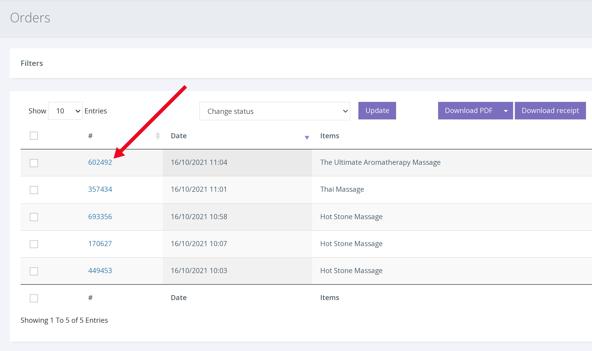

From time to time a voucher may go missing. This could be for a number of reasons, for example the customer has entered a wrong address (email or postal address) or a physical voucher is lost in the postal system.

To resend an order/voucher via post or email

1. Click ORDERS from the left hand navigation.

2. Enter the order/voucher number into the search bar.

3. Click on the order to bring up the order details

4. Click the [Delivery] tab. Doing so will show the postal address (if purchased with postal delivery) and an email delivery address. Or just a delivery address if purchased as an e-voucher.

5. Check the details of the recipient, and make changes to address or email if necessary, before clicking ‘Resend’ to have the order/voucher resent to the customer
