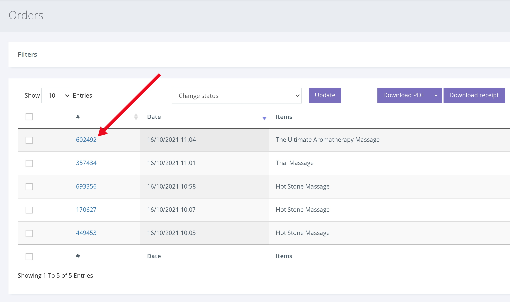
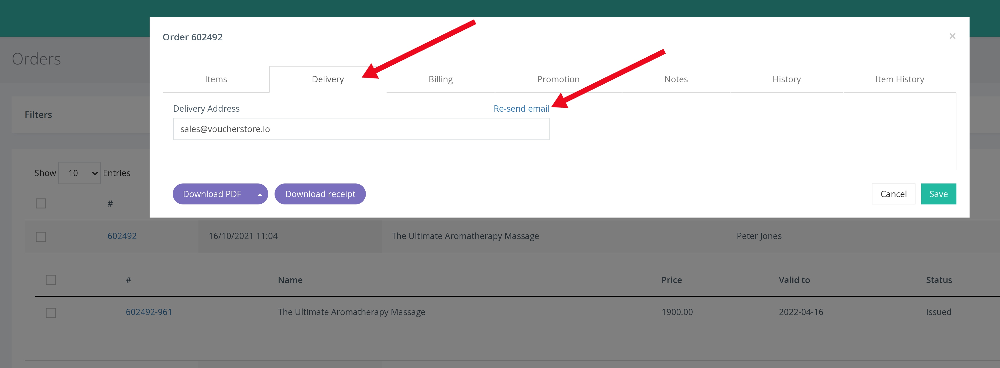

บางครั้งบัตรกำนัลอาจหายไป ซึ่งอาจเกิดจากหลายสาเหตุ เช่น ลูกค้าป้อนที่อยู่ผิด (อีเมล หรือ ที่อยู่ไปรษณีย์) หรือใบสำคัญสูญหายในระบบไปรษณีย์

ส่ง คำสั่งซื้อ/คูปอง อีกครั้งทางไปรษณีย์ หรือ อีเมล

1. คลิก ORDERS จากการนำทางด้านซ้ายมือ

2. ป้อนหมายเลขคำสั่งซื้อ/หมายเลขบัตรกำนัลลงในแถบค้นหา

3. คลิกที่คำสั่งซื้อเพื่อแสดงรายละเอียดคำสั่งซื้อ

4. คลิกแท็บ [Delivery] การทำเช่นนั้นจะแสดงที่อยู่ไปรษณีย์ (หากซื้อพร้อมการจัดส่งทางไปรษณีย์) และที่อยู่สำหรับจัดส่งทางอีเมล หรือ เพียงแค่ใส่ที่อยู่ในการจัดส่งหากซื้อแบบ e-voucher

5. ตรวจสอบรายละเอียดของผู้รับ และทำการเปลี่ยนแปลงที่อยู่ หรือ อีเมล หากจำเป็น ก่อนคลิก 'Resend' เพื่อให้ คำสั่งซื้อ/ใบสำคัญ ส่งถึงลูกค้าอีกครั้ง
