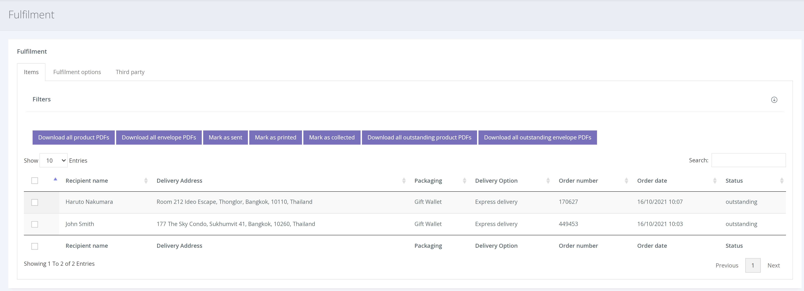

If you are fulfilling postal/collection orders yourself, this is what you will need to do.

1. From the left hand navigation click FULFILMENT

2. Click the [Items] tab to show a list of all fulfilment orders to date. Items that have not been sent/collected are prioritised.

3. Using the check-boxes next to each order, you are able to select the order(s) you would like to print, send, dispatch or mark as collected.

There is also an option to download all outstanding vouchers and envelopes (as a pdf) to speed up the process.
