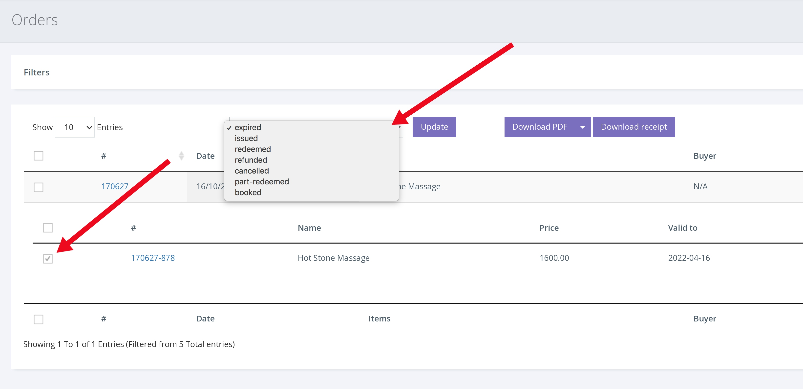
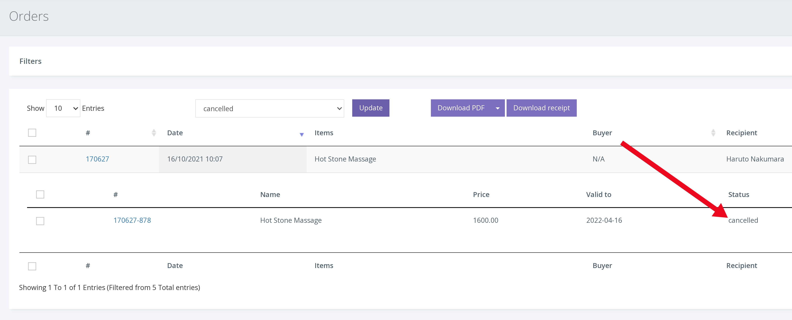

To cancel a voucher;

1. Click ORDERS from the left hand navigation.

2. You will now see the most recent orders. To find a specific voucher, input the voucher/order number into the search bar and press enter. 

3. With the order now expanded, click the checkbox to the left of the voucher number to select that voucher.

4. Then select 'Cancelled' from the 'Change status' drop down. Clicking [Update] will change the status to cancelled. As shown below.

