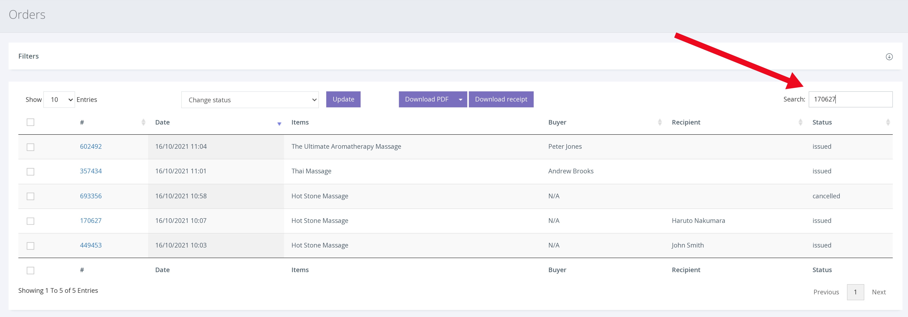
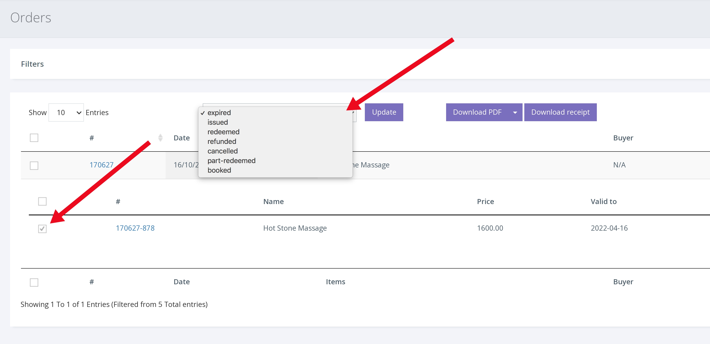
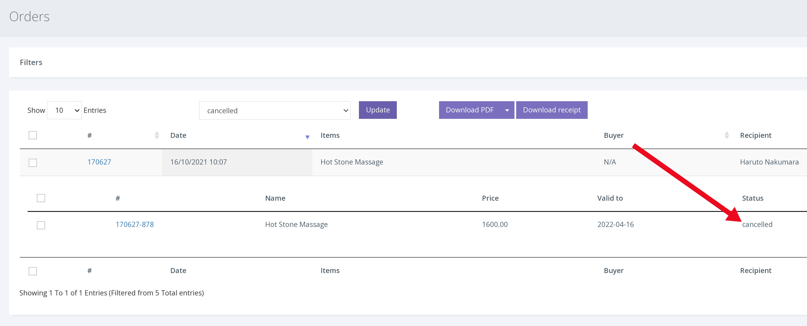

หากต้องการยกเลิกบัตรกำนัล

1. คลิก ORDERS จากการนำทางด้านซ้ายมือ

2. ตอนนี้คุณจะเห็นคำสั่งซื้อล่าสุด หากต้องการค้นหาบัตรกำนัลที่เฉพาะเจาะจงให้ป้อน หมายเลขของบัตรกำนัล/คำสั่งซื้อ ลงในแถบค้นหาแล้วกด Enter

3. เมื่อขยายคำสั่งซื้อแล้วให้คลิกช่องทำเครื่องหมายเช็คถูก ทางด้านซ้ายของหมายเลขบัตรกำนัลเพื่อเลือกบัตรกำนัลนั้น

4. จากนั้นเลือก 'Cancelled' จากเมนูแบบเลื่อนลง 'Change status' การคลิก [Update] จะเปลี่ยนสถานะเป็นยกเลิก ดังที่แสดงด้านล่าง

