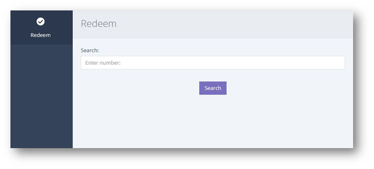
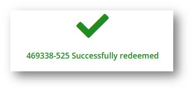

This type of redemption is for users with basic permissions. It offers a simple way for staff to redeem a voucher without needing access to the orders page.

From the left hand navigation click REDEEM.

Enter the customer's voucher number into the search bar. You must enter the complete number including the hyphen (-)

**Voucher is valid** 

If the voucher is valid a large [Redeem] button will display. 

After clicking [Redeem] you will receive a positive confirmation as shown below.

**Voucher is not valid** 

If the voucher is not valid, it will show a red cross and let you know the reason why, typically this is because the voucher has already been used or has expired.

