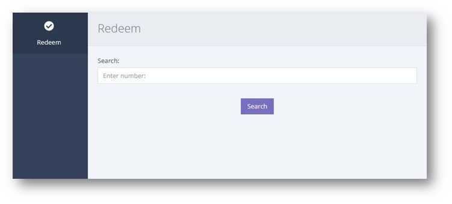
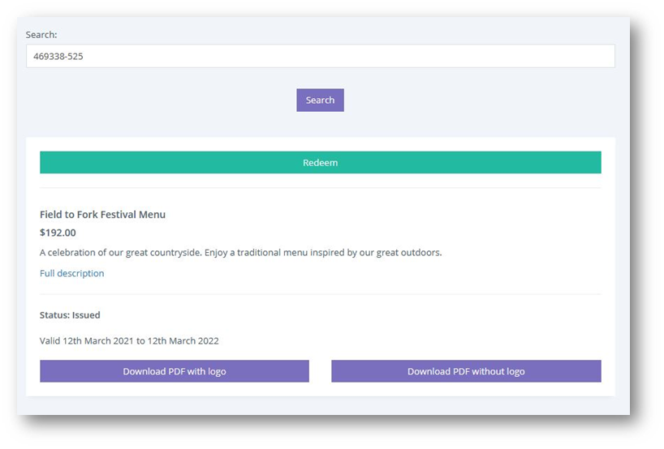
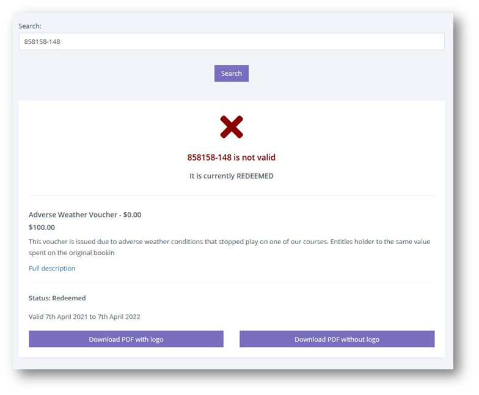

หน้านี้มีไว้สำหรับผู้ใช้ที่มีสิทธิ์แบบจำกัด เสนอวิธีง่าย ๆ สำหรับพนักงานในการแลกบัตรกำนัลโดยไม่ต้องเข้าถึงหน้าคำสั่งซื้อ

จากเมนูด้านซ้ายมือ ให้คลิก REDEEM

ป้อนหมายเลขบัตรกำนัลของลูกค้าลงในแถบค้นหา ซึ่งต้องกรอกตัวเลขให้ครบถ้วนรวมทั้ง (-)

**เวาเชอร์นี้สามารถใช้ได้** 

หากบัตรกำนัลถูกต้อง ปุ่ม [Redeem] ขนาดใหญ่จะปรากฏขึ้น

หลังจากคลิก [Redeem] คุณจะได้รับการยืนยัน ดังที่แสดงด้านล่าง

**เวาเชอร์นี้ไม่สามารถใช้ได้** 

หากบัตรกำนัลไม่ถูกต้องจะแสดงรูป กากบาทสีแดง พร้อมแจ้งให้คุณทราบสาเหตุ โดยทั่วไปเป็นเพราะบัตรกำนัลถูกใช้ไปแล้ว หรือ หมดอายุ

