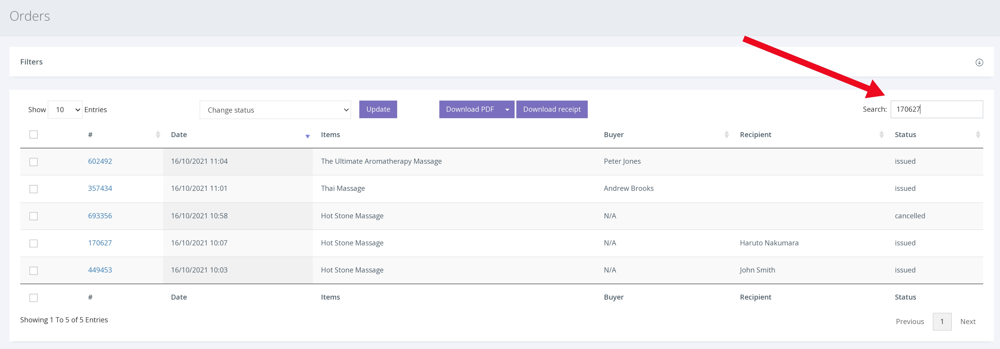

Refunding a voucher will ensure that the voucher status is set to ‘refunded’ and that it cannot be redeemed in the future. However, this will not automatically refund the customers money. This step depends on the customers original payment method.

**Refunding on Voucherstore** 

Firstly, to refund on Voucherstore, go to the ‘Orders’ tab in the dashboard and then enter the voucher number you would like to refund into the search bar.

1. Click ORDERS from the left hand navigation.

2. A list of the most recent orders is displayed. To find a specific voucher, input the voucher/order number into the search bar and press enter.

3. With the order now expanded, click the checkbox to the left of the voucher number to select that voucher.

4. On the ‘Change Status’ dropdown select ‘Refunded’ and click [Update]. The voucher is now set to ‘Refunded’ and cannot be redeemed. As shown below.

**Refunding on Stripe** 

Refunding the money to the customer must be done via Stripe. To do this, please follow the steps shown on Stripe [here](https://stripe.com/docs/refunds).
