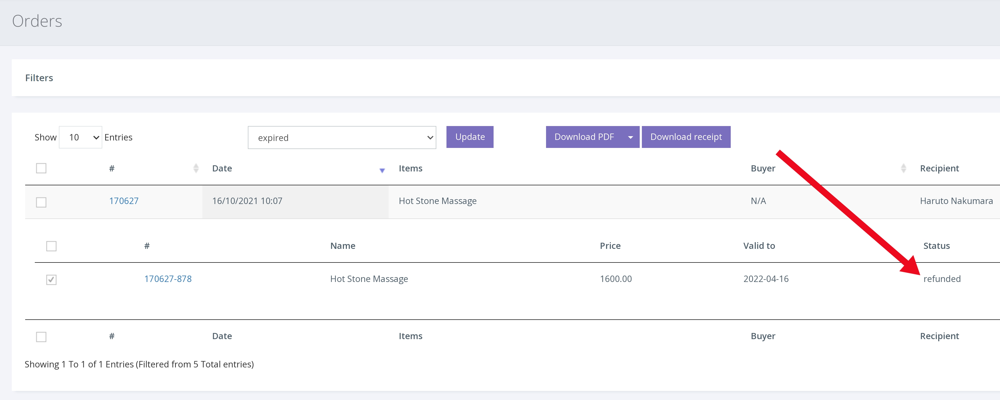

การคืนเงินบัตรกำนัล จะช่วยให้มั่นใจได้ว่าสถานะบัตรกำนัลถูกตั้งค่าเป็น 'คืนเงิน' และไม่สามารถแลกได้ในอนาคต อย่างไรก็ตาม การดำเนินการนี้จะไม่คืนเงินของลูกค้าโดยอัตโนมัติ ขั้นตอนนี้ขึ้นอยู่กับวิธีการชำระเงินเดิมของลูกค้า

**การขอคืนเงินใน Voucherstore** 

ประการแรก หากต้องการคืนเงินใน Voucherstore ให้ไปที่แท็บ "Orders" ในแดชบอร์ด จากนั้นป้อนหมายเลขบัตรกำนัลที่คุณต้องการคืนเงินลงในแถบค้นหา

1. คลิก ORDERS จากเมนูด้านซ้ายมือ

2. รายการคำสั่งซื้อล่าสุดจะปรากฏขึ้น หากต้องการค้นหาบัตรกำนัลที่เฉพาะเจาะจง ให้ป้อน หมายเลขบัตรกำนัล/คำสั่งซื้อ ลงในแถบค้นหาแล้วกด Enter

3. เมื่อขยายคำสั่งซื้อแล้วให้คลิกช่อง ทำเครื่องหมายถูก ทางด้านซ้ายของหมายเลขบัตรกำนัลเพื่อเลือกบัตรกำนัลนั้น

4. ในรายการดรอปดาวน์ "Change Status" ให้เลือก "Refunded" แล้วคลิก [Update] ตอนนี้ Voucher ถูกตั้งค่าเป็น 'Refunded' และไม่สามารถแลกได้ ดังที่แสดงด้านล่าง

**การคืนเงินผ่าน Stripe** 

การคืนเงินให้กับลูกค้าจะต้องดำเนินการผ่าน Stripe ในการดำเนินการนี้ โปรดทำตามขั้นตอนที่แสดงบน Stripe [ที่นี่](https://stripe.com/docs/refunds)
